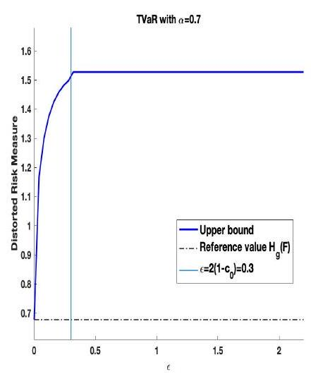

January 11, 2023

\begin{abstract}
The robustness of risk measures to changes in underlying loss distributions (distributional uncertainty) is of crucial importance in making well-informed decisions. In this paper, we quantify, for the class of distortion risk measures with an absolutely continuous distortion function, its robustness to distributional uncertainty by deriving its largest (smallest) value when the underlying loss distribution has a known mean and variance and, furthermore, lies within a ball - specified through the Wasserstein distance - around a reference distribution. We employ the technique of isotonic projections to provide for these distortion risk measures a complete characterisation of sharp bounds on their value, and we obtain quasi-explicit bounds in the case of Value-at-Risk and Range-Value-at-Risk. We extend our results to account for uncertainty in the first two moments and provide applications to portfolio optimisation and to model risk assessment.

Key words: Risk Bounds, Distortion Risk Measures, Wasserstein Distance, Distributional Robustness, Range Value-at-Risk, Model Uncertainty

History: Earlier versions have been presented at the Conference on Quantitative Risk Management and Financial Technology (Waterloo, Canada), the INFORMS Annual Meeting (Seattle, USA), the Quantact lab (Montréal, Canada), the Workshop on Insurance Mathematics (London, Canada), the Bahnhofs Colloquium of the Swiss Actuarial Society (Zurich, Switzerland), the University of Waterloo (Canada), the Quantact (Montréal, Canada), and the University of Siegen (Germany).
\end{abstract}

\section{Introduction}

Many decisions in financial risk management are based on evaluations of so-called risk or performance measures, e.g., Value-at-Risk (VaR) and Tail Value-at-Risk (TVaR) (EIOPA 2009, BCBS 2013), which are limit cases of Range Value-at-Risk (RVaR) (Cont et al. 2010). Risk managers rely on such measures, as they provide a classification of risk severities by associating to every loss distribution a real number (Artzner et al. 1999). Many risk measures are, however, highly sensitive to changes in the underlying loss distribution, and this vulnerability can contribute to adverse decisions; see Cont et al. (2010), Kou et al. (2013), Embrechts et al. (2015), and Pesenti et al. (2016). Here, we quantify distributional uncertainty via bounds on the values of risk measures. Specifically, we study worst-case and best-case values of risk measures - that is, the largest (resp.smallest) value a risk measure can attain when the loss distribution belongs to a set of plausible alternative distributions.

The literature on risk bounds presents two main approaches. The first studies risk bounds for the aggregate portfolio loss $S=X_{1}+\ldots+X_{n}$ given that the components have known marginal distributions but unknown interdependence; see, among others, Denuit et al. (1999), Embrechts and Puccetti (2006), Wang and Wang (2011), and Embrechts et al. (2013). Although explicit results can be derived in certain cases of interest, the bounds obtained are typically too wide to be practically useful. Specifically, the upper bound on a distortion risk measure is always at least as large as its value under the assumption of a comonotonic dependence, a situation that is arguably very extreme. Papers that study bounds with additional dependence constraints or by imposing modelling structures include Bernard et al. (2017), Lux and Rüschendorf (2019), and Wang et al. (2019). Another stream of the literature is concerned with deriving risk bounds of the aggregate loss $S$ under partial knowledge of its moments. Since only information on the moments of $S$ is required, these risk bounds apply to non-linear loss models, such as re-insurance portfolios, and to loss models for which the explicit aggregation is not known analytically, e.g., when $S$ is obtained via simulation models. As (higher) moments of the aggregate loss $S$ depend both on the marginal distributions and their interdependence, one thus retains some aspects of the marginal distributions and dependence information. Relevant papers include Hürlimann (2002) for the case of VaR and Cornilly et al. (2018) and Zhu and Shao (2018) for the case of (concave) distortion risk measures. Risk bounds that use additional refined information, such as uni-modality or symmetry, can be found in, e.g., Li et al. (2018).

This paper is situated in the second stream, in that we consider risk bounds of an aggregate loss $S$ under knowledge of its first two moments. However, we additionally impose a probability distance constraint on $S$, specified via the Wasserstein distance. Specifically, all alternative aggregate loss distributions, over which the worst- and best- cases are sought - the uncertainty set - lie within a tolerance distance from a reference loss distribution. Thus, the size of the tolerance distance determines the uncertainty around the reference distribution, which may also entail uncertainties on its components. Indeed, if the tolerance is small enough, the uncertainty set contains only the reference distribution, whereas if the tolerance distance increases to infinity, we recover bounds with moments constraints only. Therefore, the tolerance distance allows for a refined notion of model risk, which results in a continuous spectrum of risk bounds interpolating from the risk of the reference distribution to the bounds on the aggregate loss under the knowledge of the first two moments only.

Worst- (best-) case values under probability distance constraints have been considered by Glasserman and Xu (2014) and Lam (2016), who use the Kullback-Leibler divergence, as well as by Blanchet and Murthy (2019), who utilise distances stemming from mass transportation. These papers, however, consider the expected value of a function of the loss random variable, whereas here we study the class of distortion risk measures. Moreover, we use a distance that allows for comparison of distributions on differing support, which is important in our context as it is not clear a priori whether the worst-case distribution shares the same support as the reference distribution. For example, a discrete reference distribution, together with a particular choice of distortion risk measure (e.g., inverse-S shaped), will result in a continuous worst-case distribution. In this work, we quantify the distance between the alternative distribution function and the reference distribution via the Wasserstein distance of order 2 . The Wasserstein distance has been widely applied to model distributional uncertainty in financial contexts (see e.g., Pflug and Wozabal (2007), Bartl et al. (2020) and Chen and Xie (2021)), and as a distance from reference model (see e.g., Pesenti (2021) and Pesenti and Jaimungal (2021)).

A related stream of literature studies distributionally robust optimisation, leading to an optimum in the worst case. Relevant literature, in which the worst-case value of a distortion risk measure is considered includes Cai et al. (2020) and Pesenti et al. (2020). Cai et al. (2020) consider distortion risk measures under the assumption that the uncertainty set of the components $X_{1}, \ldots, X_{n}$ is characterised by the knowledge of their moments, the components having compact support and additional convex constraints. Pesenti et al. (2020) consider signed Choquet Integrals (see Section 2 for a definition) and uncertainty sets characterised by so-called closedness-under-concentration. Neither of these works considers the Wasserstein distance, and the closedness-under-concentration condition is not compatible with uncertainty sets that are $\sqrt{\varepsilon}$-Wasserstein balls around an (arbitrary) reference distribution.

In this paper, we derive for any given distortion risk measure (with absolutely continuous distortion function) its worst- and best-case values when the loss distribution has known first two moments and lies within a tolerance distance from a reference distribution, specified through the Wasserstein distance. To derive these bounds, we propose a novel approach that builds on the technique of isotonic projections (Németh (2003)). As a result, we obtain quasi analytical bestand worst-case bounds that significantly improve existing moment bounds. We find that for small Wasserstein tolerance distances, the worst-case distribution function (the distribution function attaining the worst-case value) is close (in a probabilistic sense) to the reference distribution, whereas for large tolerance distances the worst-case distribution function is no longer affected by the reference distribution. Thus, when the Wasserstein tolerance distance goes to infinity, the reference distribution becomes irrelevant, and we recover, as corollaries to our results, known moment bounds on distortion risk measures; see Li (2018) and Zhu and Shao (2018). Indeed, Li (2018) considers worst-case concave distortion risk measures with given mean and standard deviation, and Zhu and Shao (2018) consider the best-case and worst-case of the entire class of distortion risk measure under the knowledge of the first two moments. Neither considers a Wasserstein constraint. We further apply our results to obtain quasi-explicit bounds on the RVaR and on the VaR as limiting cases. We find that for small Wasserstein tolerance distances, the worst-case distribution functions for RVaR and VaR are no longer two-point distributions, thus making the bounds attractive for financial risk management applications.

This paper is structured as follows: Section 2 introduces the necessary notation and formulates the problem. The main results - the quasi-analytical best- and worst-case values of distortion risk measures under a Wasserstein distance constraint - are presented in Section 3. Section 4 contains two extensions. In Section 4.1, we calculate bounds of VaR. In Section 4.3, we extend our results to complete moment uncertainty - that is, when the uncertainty set is a $\sqrt{\varepsilon}$-Wasserstein ball around a reference distribution without any moment constraints. We provide applications of the risk bounds to portfolio optimisation and to model risk assessment of an insurance portfolio, including rationales for choosing the Wasserstein distance, in Section 5. All proofs are relegated to the appendix.

\section{Problem Formulation}

We consider an atomless probability space $(\Omega, \mathcal{A}, \mathbb{P})$ and let $L^{2}=L^{2}(\Omega, \mathcal{A}, \mathbb{P})$ be the set of all square integrable random variables on that space. We denote by $\mathcal{M}^{2}=\left\{G(x)=\mathbb{P}(X \leq x) \mid X \in L^{2}\right\}$ the corresponding space of distribution functions with finite second moment. The (left-continuous) inverse, also called the quantile function, of a distribution function $G \in \mathcal{M}^{2}$ is $G^{-1}(u)=\inf \{y \in$ $\mathbb{R} \mid G(y) \geq u\}$, and we denote its right-continuous inverse by $G^{-1,+}(u)=\inf \{y \in \mathbb{R} \mid G(y)>u\}, 0<$ $u<1$. Throughout the exposition, we write $U \sim \mathcal{U}(0,1)$ for a standard uniform random variable on $(0,1)$ 

\subsection{Distortion Risk Measures}

In this section, we recall the class of distortion risk measures that contains risk measures commonly encountered in financial applications, such as VaR and TVaR. A distortion risk measure, evaluated at a distribution function $G \in \mathcal{M}^{2}$, is defined via the Choquet integral

$$
H_{g}(G)=-\int_{-\infty}^{0} 1-g(1-G(x)) \mathrm{d} x+\int_{0}^{+\infty} g(1-G(x)) \mathrm{d} x
$$

whenever at least one of the two integrals is finite. The function $g:[0,1] \rightarrow[0,1]$ refers to a distortion function - that is, a non-decreasing function satisfying $g(0)=0$ and $g(1)=1$. If $g$ is absolutely continuous, then the distortion risk measure $H_{g}$ has the following representation (Dhaene et al. 2012)

$$
H_{g}(G)=\int_{0}^{1} \gamma(u) G^{-1}(u) \mathrm{d} u,
$$

with weight function $\gamma(u)=\left.\partial_{-} g(x)\right|_{x=1-u}, 0<u<1$, which satisfies $\int_{0}^{1} \gamma(u) \mathrm{d} u=1$ and where $\partial_{-}$ denotes the derivative from the left. In what follows, we may sometimes write $H_{g}\left(G^{-1}\right)$ instead of $H_{g}(G)$

Assumption 1. We assume that representation (1) holds and that $\int_{0}^{1}|\gamma(u)|^{2} \mathrm{~d} u<+\infty$.

Throughout the paper, we use the following three concave distortion risk measures to illustrate our results: the dual power distortion with parameter $\beta>0$

$$
g(x)=1-(1-x)^{\beta}, \quad \text { and } \quad \gamma(u)=\beta u^{\beta-1} ;
$$

the Wang transform (Wang 1996) with parameter $0<q_{0}<1$,

$$
g(x)=\Phi\left(\Phi^{-1}(x)+\Phi^{-1}\left(q_{0}\right)\right), \quad \text { and } \quad \gamma(u)=\frac{\phi\left(\Phi^{-1}(1-u)+\Phi^{-1}\left(q_{0}\right)\right)}{\phi\left(\Phi^{-1}(1-u)\right)}
$$

where $\Phi$ and $\phi$ denote the standard normal distribution and its density, respectively; and the Tail Value-at-Risk $\left(\mathrm{TVaR}_{\alpha}\right.$ ), also called Expected Shortfall, at level $0<\alpha<1$ (Acerbi 2002) with

$$
g(x)=\min \left\{\frac{x}{1-\alpha}, 1\right\} \quad \text { and } \quad \gamma(u)=\frac{1}{1-\alpha} \mathbb{1}_{(\alpha, 1)}(u) .
$$

In Section 4.1, we also consider the case of Value-at-Risk $\left(\operatorname{VaR}_{\alpha}\right), 0<\alpha<1$, a distortion risk measure with $g(x)=\mathbb{1}_{(1-\alpha, 1]}(x)$ that does not satisfy Assumption 1 . 

\subsection{Modelling Distributional Uncertainty}

In financial risk management, distributional uncertainty is prevalent and bounds on the value of a risk measure, so-called worst-and best-case values or upper and lower bounds, are valuable tools for decision making. A worst- (best-) case value of a risk measure is defined as the largest (smallest) value a risk measure can attain when the underlying distribution belongs to a set of alternative distributions. Here, we consider subsets of $\mathcal{M}^{2}$ that are characterised via a tolerance distance to a reference distribution, specified through the Wasserstein distance of order 2. Distribution functions belonging to such an uncertainty set may be viewed as alternatives to the reference distribution, representing model misspecification or alternative model assumptions. To formalise this, we recall the definition of the Wasserstein distance. The Wasserstein distance exhibits desirable properties, such as no restriction on the support of distribution functions, which is in contrast to the KullbackLeibler divergence; see Villani (2008) for a discussion of the Wasserstein distance.

Definition 1 (Wasserstein distance of ORder 2). The Wasserstein distance of order 2 between $G_{1}, G_{2} \in \mathcal{M}^{2}$ is (Villani 2008)

$$
d_{W}\left(G_{1}, G_{2}\right)=\inf \left\{\left[\mathbb{E}\left(\left(X_{1}-X_{2}\right)^{2}\right)\right]^{\frac{1}{2}} \mid X_{1} \sim G_{1}, X_{2} \sim G_{2}\right\}
$$

where the infimum is taken over all bivariate distributions with marginals $G_{1}$ and $G_{2}$.

For distributions on the real line, the Wasserstein distance admits the following well-known representation (Dall'Aglio 1956)

$$
d_{W}\left(G_{1}, G_{2}\right)=\left(\int_{0}^{1}\left(G_{1}^{-1}(u)-G_{2}^{-1}(u)\right)^{2} \mathrm{~d} u\right)^{\frac{1}{2}} .
$$

Hence, the Wasserstein distance between $G_{1}$ and $G_{2}$ is uniquely determined by their corresponding quantile functions, and we may write $d_{W}\left(G_{1}^{-1}, G_{2}^{-1}\right)$ instead of $d_{W}\left(G_{1}, G_{2}\right)$.

We denote by $F \in \mathcal{M}^{2}$ the reference distribution and its first two moments by $\int x \mathrm{~d} F(x)=\mu_{F} \in \mathbb{R}$ and $\int x^{2} \mathrm{~d} F(x)=\mu_{F}^{2}+\sigma_{F}^{2}, \sigma_{F}>0$, respectively. Throughout, we fix the reference distribution $F$ and consider distributional uncertainty sets of the type

$$
\mathcal{M}_{\varepsilon}(\mu, \sigma)=\left\{G \in \mathcal{M}^{2} \mid \int x \mathrm{~d} G(x)=\mu, \int x^{2} \mathrm{~d} G(x)=\mu^{2}+\sigma^{2}, d_{W}(F, G) \leq \sqrt{\varepsilon}\right\}
$$

where $\mu \in \mathbb{R}, \sigma>0$, and $0 \leq \varepsilon \leq+\infty$. The set $\mathcal{M}_{\varepsilon}(\mu, \sigma)$ thus contains all distribution functions whose first two moments are $\mu$ and $\mu^{2}+\sigma^{2}$, respectively, and that lie within a $\sqrt{\varepsilon}$-Wasserstein ball around the reference distribution $F$. The $\varepsilon$-constraint in the definition of $\mathcal{M}_{\varepsilon}(\mu, \sigma)$ is redundant when $\varepsilon=+\infty$, and in this special case we denote the uncertainty set $\mathcal{M}_{\infty}(\mu, \sigma)$ by $\mathcal{M}(\mu, \sigma)$. Note that in applications, one may often encounter that $(\mu, \sigma)=\left(\mu_{F}, \sigma_{F}\right)$, but our set-up allows them to be different, which could for example be useful when their values are estimated using different data sources.

The best- and worst-case values of a distortion risk measure $H_{g}$ over the distributional uncertainty set $\mathcal{M}_{\varepsilon}(\mu, \sigma)$ are respectively defined by

$$
\inf _{G \in \mathcal{M}_{\varepsilon}(\mu, \sigma)} H_{g}(G)
$$

$$
\sup _{G \in \mathcal{M}_{\varepsilon}(\mu, \sigma)} H_{g}(G) .
$$

In addition to the best- and worst-case values, we also study best-case and worst-case distribution functions if they exist - that is, the distribution functions attaining (5a) and (5b), respectively

$$
\underset{G \in \mathcal{M}_{\varepsilon}(\mu, \sigma)}{\arg \min } H_{g}(G)
$$

$$
\underset{G \in \mathcal{M}_{\varepsilon}(\mu, \sigma)}{\arg \max } H_{g}(G) .
$$

We impose two additional conditions that are necessary in order to ensure that the considered optimisation problems are relevant and well-posed.

Assumption 2. We assume that $\gamma(\cdot) \neq 1$; otherwise $H_{g}(G)=\mu$ for all $G \in \mathcal{M}_{\varepsilon}(\mu, \sigma)$ and problems (5) and (6) are obsolete.

Assumption 3. We assume that $\mathcal{M}_{\varepsilon}(\mu, \sigma)$ contains at least two elements, and hence infinitely many; otherwise problems (5) and (6) are either ill-posed or trivial.

In this regard, Assumption 3 is equivalent to assuming that $\varepsilon>\left(\mu_{F}-\mu\right)^{2}+\left(\sigma_{F}-\sigma\right)^{2}$. To see this, note that for any $G \in \mathcal{M}_{\varepsilon}(\mu, \sigma)$

$$
\begin{aligned}
d_{W}(F, G)^{2} & =\int_{0}^{1}\left(F^{-1}(u)-G^{-1}(u)\right)^{2} \mathrm{~d} u \\
& =\mu_{F}^{2}+\sigma_{F}^{2}+\mu^{2}+\sigma^{2}-2 \operatorname{cov}\left(F^{-1}(U), G^{-1}(U)\right)-2 \mu \mu_{F}
\end{aligned}
$$

$$
\begin{aligned}
& =\left(\mu_{F}-\mu\right)^{2}+\left(\sigma_{F}-\sigma\right)^{2}+2 \sigma \sigma_{F}\left(1-\operatorname{corr}\left(F^{-1}(U), G^{-1}(U)\right)\right) \\
& \geq\left(\mu_{F}-\mu\right)^{2}+\left(\sigma_{F}-\sigma\right)^{2}
\end{aligned}
$$

Hence, if $\varepsilon<\left(\mu_{F}-\mu\right)^{2}+\left(\sigma_{F}-\sigma\right)^{2}$, then $\mathcal{M}_{\varepsilon}(\mu, \sigma)=\emptyset$, and if $\varepsilon=\left(\mu_{F}-\mu\right)^{2}+\left(\sigma_{F}-\sigma\right)^{2}$, then $\mathcal{M}_{\varepsilon}(\mu, \sigma)$ is a singleton, containing only one distribution with quantile function

$$
G^{-1}(u)=\mu+\sigma\left(\frac{F^{-1}(u)-\mu_{F}}{\sigma_{F}}\right), \quad 0<u<1 .
$$

Moreover, in this special case, $G$ coincides with the reference distribution $F$ if and only if $\mu=\mu_{F}$ and $\sigma=\sigma_{F}$. Thus, from now on, we assume that $\varepsilon>\left(\mu_{F}-\mu\right)^{2}+\left(\sigma_{F}-\sigma\right)^{2}$.

\section{Bounds on Distortion Risk Measures}

For ease of exposition, we first study worst-case values (5b) and worst-case distribution functions (6b) for the class of concave distortion risk measures that are distortion risk measures with concave distortion function $g$. The corresponding results for the case of general distortion risk measures are presented in Section $3.2$ and those for best-case values (5a) and best-case distributions (6a) in Section 3.3.

\subsection{Upper Bounds on Concave Distortion Risk Measures}

Concave distortion risk measures are a subset of the class of distortion risk measures that are coherent and include the widely used TVaR. Furthermore, concave distortion risk measures span the class of law-invariant, coherent, and comonotone additive risk measures (Kusuoka 2001). For the special case of concave distortion risk measures, we obtain analytic solutions to problems (5b) and (6b), which are presented in the following theorem.

Theorem 1 (Worst-Case Values and Quantiles of Concave Distortions). Let Assumptions 1, 2, and 3 be fulfilled. Further, let $g$ be a concave distortion function and denote by $c_{0}=$ $\operatorname{corr}\left(F^{-1}(U), \gamma(U)\right){ }^{1}$ Then, the following statements hold:

${ }^{1}$ If $c_{0}=1$, then only case 2. applies. 1. If $\left(\mu_{F}-\mu\right)^{2}+\left(\sigma_{F}-\sigma\right)^{2}<\varepsilon<\left(\mu_{F}-\mu\right)^{2}+\left(\sigma_{F}-\sigma\right)^{2}+2 \sigma \sigma_{F}\left(1-c_{0}\right)$, then the solution to (6b) is unique and has a quantile function given by

$$
h_{\lambda}(u)=\mu+\sigma\left(\frac{\gamma(u)+\lambda F^{-1}(u)-a_{\lambda}}{b_{\lambda}}\right), \quad 0<u<1,
$$

where $\lambda>0$ denotes the unique positive solution to $d_{W}\left(F^{-1}, h_{\lambda}\right)=\sqrt{\varepsilon}$, which is explicitly given by

$$
\lambda=\frac{K}{\sigma_{F}^{2}} \sqrt{\frac{C_{\gamma, F}^{2}-V \sigma_{F}^{2}}{K^{2}-\sigma^{2} \sigma_{F}^{2}}}-\frac{C_{\gamma, F}}{\sigma_{F}^{2}}
$$

where $V=\operatorname{var}(\gamma(U)), C_{\gamma, F}=\operatorname{cov}\left(F^{-1}(U), \gamma(U)\right)$, and $K=\frac{\mu_{F}^{2}+\sigma_{F}^{2}+\mu^{2}+\sigma^{2}-2 \mu \mu_{F}-\varepsilon}{2} \geq 0$ and where $a_{\lambda}=\mathbb{E}\left(\gamma(U)+\lambda F^{-1}(U)\right)$ and $b_{\lambda}=\operatorname{std}\left(\gamma(U)+\lambda F^{-1}(U)\right)$. The corresponding worst-case value, i.e., the solution to $(5 \mathrm{~b})$, is

$$
H_{g}\left(h_{\lambda}\right)=\mu+\frac{\sigma}{b_{\lambda}}\left(V+\lambda C_{\gamma, F}\right)=\mu+\sigma \operatorname{std}(\gamma(U)) \operatorname{corr}\left(\gamma(U), \gamma(U)+\lambda F^{-1}(U)\right)
$$

and $H_{g}\left(h_{\lambda}\right)$ is continuous in $\varepsilon$.

2. If $\left(\mu_{F}-\mu\right)^{2}+\left(\sigma_{F}-\sigma\right)^{2}+2 \sigma \sigma_{F}\left(1-c_{0}\right) \leq \varepsilon$, then case 1. applies with $\lambda=0$.

The worst-case value provided in Theorem 1 is sharp for all $\left(\mu_{F}-\mu\right)^{2}+\left(\sigma_{F}-\sigma\right)^{2}<\varepsilon \leq+\infty$ and attained by the worst-case quantile function $h_{\lambda}$. We observe that $h_{\lambda}$ is a weighted average of the reference quantile function $F^{-1}$ and the (non-decreasing) weight function $\gamma$ from the distortion risk measure. As the worst-case value $H_{g}$ is non-decreasing in the tolerance distance $\varepsilon$, we obtain that $\operatorname{corr}\left(\gamma(U), \gamma(U)+\lambda F^{-1}(U)\right)$ is non-decreasing in $\varepsilon$, which in turn implies that $\lambda$ is non-increasing in $\varepsilon$. Hence, we obtain that the influence of the reference distribution on the worst-case quantile function $h_{\lambda}$ diminishes with increasing tolerance distance $\varepsilon$. Furthermore, for $\varepsilon$ sufficiently large, i.e., under case 2. of Theorem $1, \lambda$ is zero and the worst-case quantile function is independent of the reference distribution. Note that when $\varepsilon=\left(\mu_{F}-\mu\right)^{2}+\left(\sigma_{F}-\sigma\right)^{2}+2 \sigma \sigma_{F}\left(1-c_{0}\right)$, the expression of $\lambda$ in (7) is still valid and simplifies to $\lambda=0$.

As a direct corollary we obtain the worst-case values of TVaR. The proof is omitted as it follows by direct calculations from Theorem 1 . Corollary 1 (Worst-case Value of TVaR). Let Assumption 3 be fulfilled. Then, the worstcase value of the $T V a R_{\alpha}$ is given by

$$
\sup _{G \in \mathcal{M}_{\varepsilon}(\mu, \sigma)} T V a R_{\alpha}(G)=\mu+\sigma \frac{\frac{\alpha}{1-\alpha}+\lambda\left(T V a R_{\alpha}(F)-\mu_{F}\right)}{\sqrt{\frac{\alpha}{1-\alpha}+2 \lambda\left(T V a R_{\alpha}(F)-\mu_{F}\right)+\lambda^{2} \sigma_{F}^{2}}},
$$

Here, if $\varepsilon<\left(\mu_{F}-\mu\right)^{2}+\left(\sigma_{F}-\sigma\right)^{2}+2 \sigma \sigma_{F}\left(1-c_{0}\right)$ then $\lambda$ is given by equation (7) in Theorem 1 , and if $\varepsilon \geq\left(\mu_{F}-\mu\right)^{2}+\left(\sigma_{F}-\sigma\right)^{2}+2 \sigma \sigma_{F}\left(1-c_{0}\right)$, then $\lambda=0$

Theorem 1 generalises results that first appeared in Li (2018). This author derived sharp upper bounds on $H_{g}$ under the knowledge of the first two moments, i.e., without considering an $\sqrt{\varepsilon}$ Wasserstein distance constraint or a reference distribution. Applying Theorem 1 with $\varepsilon=+\infty$, we obtain his result, which is stated here for completeness; see also Cornilly et al. (2018) and Zhu and Shao (2018).

Corollary 2 (Worst-Case Values for $\varepsilon=+\infty ; \mathbf{L i}$ (2018)). Let Assumptions 1 and 2 be fulfilled. Further, let $g$ be a concave distortion function; then

$$
\sup _{G \in \mathcal{M}(\mu, \sigma)} H_{g}(G)=\mu+\sigma \operatorname{std}(\gamma(U))=\mu+\sigma \sqrt{\int_{0}^{1}(\gamma(p)-1)^{2} d p}
$$

The bound is sharp and obtained by a unique maximising distribution function with quantile function $h_{0}$ defined in Theorem 1.

Example 1. We illustrate the worst-case values of Theorem 1 for three concave distortion risk measures: the dual power distortion, the Wang transform, and TVaR defined in (2), (3), and (4), respectively. The reference distribution $F$ is chosen to be standard normal, and we further set $\mu=\mu_{F}=0$ and $\sigma=\sigma_{F}=1$. In the top panels of Figure 1, we observe that the upper bounds are indeed non-decreasing and continuous functions of $\varepsilon$. The turquoise coloured vertical lines display $\varepsilon^{*}=\left(\mu_{F}-\mu\right)^{2}+\left(\sigma_{F}-\sigma\right)^{2}+2 \sigma \sigma_{F}\left(1-c_{0}\right)=2\left(1-c_{0}\right)$. The parameter value $\varepsilon^{*}$ indicates the transition from case 1. to case 2. in Theorem 1; indeed, for $\varepsilon \geq \varepsilon^{*}$ case 2 . of Theorem 1 applies and the worst-case value is independent of $\varepsilon$. For $\mathrm{TVaR}_{\alpha}$ with $\alpha=0.7$ (top right panel), the worst-case value is equal to $\mu+\sigma \sqrt{\frac{\alpha}{1-\alpha}}=\sqrt{\frac{\alpha}{1-\alpha}}=1.53$, and we recover the well-known Cantelli upper bound. Dual Power Distortion

Wang Distortion

TVaR distortion

Optimal quantile -TaR with a=0.7

Figure 1 Worst-case values and quantile functions of three concave distortion risk measures; the dual power distortion (left), the Wang transform (middle), and the TVaR (right). The top panels display the worstcase values as a function of $\varepsilon$; the bottom panels display the worst-case quantile functions for selected values of $\varepsilon$.

The bottom panels of Figure 1 display the worst-case quantile functions for selected values of $\varepsilon$. We observe that for $\varepsilon=0$, the worst-case quantile functions are equal to the reference quantile functions (blue solid line). When the Wasserstein distance $\varepsilon$ increases, the influence of the reference distribution diminishes and, if $\varepsilon>2\left(1-c_{0}\right)$, the worst-case quantile function (violet dash-dotted line) is independent of the reference distribution. This can be seen clearly for TVaR, where the violet dash-dotted quantile function corresponds to a two-point distribution. 

\subsection{Upper Bounds on General Distortion Risk Measures}

To characterise the worst-case values and quantile functions of general distortion risk measures we introduce the concept of isotonic projections; see e.g., Németh (2003). For this, we denote the space of square-integrable, non-decreasing, and left-continuous functions on $(0,1)$ by

$$
\mathcal{K}=\left\{k:(0,1) \rightarrow \mathbb{R} \mid \int_{0}^{1} k(u)^{2} \mathrm{~d} u<+\infty, k \text { non-decreasing \& left-continuous }\right\} .
$$

Definition 2. For $\lambda \geq 0$, denote by $k_{\lambda}^{\uparrow}$ the isotonic projection of $\gamma+\lambda F^{-1}$ onto the space of square-integrable non-decreasing and left-continuous functions on $(0,1)$ - that is, the unique solution to

$$
k_{\lambda}^{\uparrow}=\underset{k \in \mathcal{K}}{\arg \min }\left\|\gamma+\lambda F^{-1}-k\right\|^{2},
$$

where $\|\cdot\|$ denotes the $L^{2}$ norm. Whenever $\lambda=0$, we write $\gamma^{\uparrow}$ instead of $k_{0}^{\uparrow}$, as $k_{0}^{\uparrow}$ is indeed the isotonic projection of $\gamma$ alone.

The isotonic projection differs from the isotonic regression (Barlow et al. 1972), which is a metric projection onto the set of finite dimensional and component-wise increasing vectors. We refer to Appendix A for further details and properties of isotonic projections.

We further define

$$
\lambda^{\uparrow}=\inf \left\{\lambda \geq 0 \mid k_{\lambda}^{\uparrow} \text { is not constant }\right\}
$$

and set $\inf \emptyset=+\infty$. Finally, we define for $\lambda>\lambda^{\uparrow}$ the quantile function

$$
h_{\lambda}^{\uparrow}(u)=\mu+\sigma\left(\frac{k_{\lambda}^{\uparrow}(u)-a_{\lambda}}{b_{\lambda}}\right), \quad 0<u<1,
$$

with $a_{\lambda}=\mathbb{E}\left(k_{\lambda}^{\uparrow}(U)\right)$ and $b_{\lambda}=\operatorname{std}\left(k_{\lambda}^{\uparrow}(U)\right)$. Note that $h_{\lambda}^{\uparrow}$ is well-defined whenever $\lambda>\lambda^{\uparrow}$, as the function $k_{\lambda}^{\uparrow}$ is non-constant for all $\lambda>\lambda^{\uparrow}$; see also Proposition 5 in Appendix A.

Before stating the worst-case value of general distortion risk measures, we need a further assumption.

Assumption 4. We assume that $\lambda^{\uparrow}=0$. Note that Assumption 4 is a requirement on the weight function and the reference distribution. Assumption 4 is satisfied, for instance, when $\gamma$ is bounded and the reference distribution has a quantile function that is unbounded to the right, i.e. $F^{-1}(u) \rightarrow+\infty$ for $u \rightarrow+\infty$.

Theorem 2 (Worst-Case Values and Quantiles of General Distortions). Let Assumptions 1, 2, 3, and 4 be fulfilled. Further, let $g$ be a distortion function and denote $c_{0}=$ $\lim _{\lambda \searrow 0} \operatorname{corr}\left(F^{-1}(U), k_{\lambda}^{\uparrow}(U)\right)$. Then, the following statements hold:

1. If $\left(\mu_{F}-\mu\right)^{2}+\left(\sigma_{F}-\sigma\right)^{2}<\varepsilon<\left(\mu_{F}-\mu\right)^{2}+\left(\sigma_{F}-\sigma\right)^{2}+2 \sigma \sigma_{F}\left(1-c_{0}\right)$, then a solution to (6b) is unique and is given by the quantile function $h_{\lambda}^{\uparrow}$ defined in (10), where $\lambda>0$ is the unique positive solution to $d_{W}\left(F^{-1}, h_{\lambda}^{\uparrow}\right)=\sqrt{\varepsilon}$. Furthermore, the worst-case value, i.e., the solution to (5b), is

$$
H_{g}\left(h_{\lambda}^{\uparrow}\right)=\mu+\sigma \operatorname{std}(\gamma(U)) \operatorname{corr}\left(\gamma(U), k_{\lambda}^{\uparrow}(U)\right)
$$

and $H_{g}\left(h_{\lambda}^{\uparrow}\right)$ is continuous in $\varepsilon$.

2. Let $\left(\mu_{F}-\mu\right)^{2}+\left(\sigma_{F}-\sigma\right)^{2}+2 \sigma \sigma_{F}\left(1-c_{0}\right) \leq \varepsilon$. If $\gamma^{\uparrow}$ is not constant, then case $\left.i\right)$ applies with $\lambda=0$. If $\gamma^{\uparrow}$ is constant, then the solution to (5b) is equal to $\mu$ but cannot be attained.

If $\gamma$ is non-increasing, equivalently the distortion function $g$ is convex, then its isotonic projection is constant and equal to 1 . Thus, for $\varepsilon$ that is sufficiently large, case 2 . of Theorem 2 implies that the upper bound is equal to $\mu$ and not attained. If $\gamma$ is non-decreasing, equivalently $g$ is concave, then $\gamma+\lambda F^{-1}$ is non-decreasing and thus equal to its isotonic projection. Hence, Theorem 2 reduces to Theorem 1 in the case of concave distortion risk measures. Theorem 2 generalises results by Zhu and Shao (2018), who analyse problem (5b) in the special case in which the Wasserstein constraint is redundant, which we state in the subsequent corollary.

Corollary 3 (Worst-Case Values for $\varepsilon=+\infty$; Zhu and Shao (2018)). Let Assumptions 1, 2, and 4 be fulfilled. Further, let $g$ be a distortion function; then, the following statements hold:

1. If $\gamma^{\uparrow}$ is not constant, then

$$
\sup _{G \in \mathcal{M}(\mu, \sigma)} H_{g}(G)=\mu+\sigma \operatorname{std}\left(\gamma^{\uparrow}(U)\right)=\mu+\sigma \sqrt{\int_{0}^{1}\left(\gamma^{\uparrow}(p)-1\right)^{2} d p} .
$$

The bound is sharp and attained by a distribution with quantile function $h_{0}^{\uparrow}$ defined in (10). 2. If $\gamma^{\uparrow}$ is constant, then

$$
\sup _{G \in \mathcal{M}(\mu, \sigma)} H_{g}(G)=\mu
$$

and the bound cannot be attained.

\subsection{Lower Bounds on General Distortion Risk Measures}

In a similar way as in Section 3.2, we first introduce the notation and assumptions needed to derive the best-case values and quantile functions of general distortion risk measures.

Definition 3. For $\lambda \geq 0$, denote by $k_{\lambda}^{\downarrow}$ the isotonic projection of $\gamma-\lambda F^{-1}$ onto the set of square-integrable non-increasing functions and left-continuous - that is, the unique solution to

$$
k_{\lambda}^{\downarrow}=\underset{-k \in \mathcal{K}}{\arg \min }\left\|\gamma-\lambda F^{-1}-k\right\|^{2} .
$$

Whenever $\lambda=0$, we write $\gamma^{\downarrow}$ instead of $k_{0}^{\downarrow}$, as $k_{0}^{\downarrow}$ is indeed the isotonic projection of $\gamma$ onto the non-increasing functions.

Further, we define

$$
\lambda^{\downarrow}=\inf \left\{\lambda \geq 0 \mid k_{\lambda}^{\downarrow} \text { is not constant }\right\}
$$

and for all $\lambda>\lambda^{\downarrow}$ the quantile function

$$
h_{\lambda}^{\downarrow}(u)=\mu+\sigma\left(\frac{a_{\lambda}-k_{\lambda}^{\downarrow}(u)}{b_{\lambda}}\right), \quad 0<u<1,
$$

with $a_{\lambda}=\mathbb{E}\left(k_{\lambda}^{\downarrow}(U)\right)$ and $b_{\lambda}=\operatorname{std}\left(k_{\lambda}^{\downarrow}(U)\right)$. Note that $h_{\lambda}^{\downarrow}$ is well-defined whenever $\lambda>\lambda^{\downarrow}$, as the function $k_{\lambda}^{\downarrow}$ is non-constant for all $\lambda>\lambda^{\downarrow}$; see also Proposition 5 in Appendix A.

Assumption 5. We assume that $\lambda^{\downarrow}=0$.

The next theorem states the best-case values and quantile functions of general distortion risk measures.

Theorem 3 (Best-Case Values and Quantiles of General Distortions). Let Assumptions 1, 2, 3, and 5 be fulfilled. Further, let $g$ be a distortion function and denote $c_{0}=$ $\lim _{\lambda \searrow 0} \operatorname{corr}\left(F^{-1}(U),-k_{\lambda}^{\downarrow}(U)\right)$. Then, the following statements hold: 1. If $\left(\mu_{F}-\mu\right)^{2}+\left(\sigma_{F}-\sigma\right)^{2}<\varepsilon<\left(\mu_{F}-\mu\right)^{2}+\left(\sigma_{F}-\sigma\right)^{2}+2 \sigma \sigma_{F}\left(1-c_{0}\right)$, then a solution to (6a) is unique and is given by the quantile function $h_{\lambda}^{\downarrow}$ defined in (13), where $\lambda>0$ is the unique positive solution to $d_{W}\left(F^{-1}, h_{\lambda}^{\downarrow}\right)=\sqrt{\varepsilon}$. The corresponding best-case value, i.e., the solution to (5a), is

$$
H_{g}\left(h_{\lambda}^{\downarrow}\right)=\mu-\sigma \operatorname{std}(\gamma(U)) \operatorname{corr}\left(\gamma(U), k_{\lambda}^{\downarrow}(U)\right),
$$

and $H_{g}$ is continuous in $\varepsilon$

2. Let $\left(\mu_{F}-\mu\right)^{2}+\left(\sigma_{F}-\sigma\right)^{2}+2 \sigma \sigma_{F}\left(1-c_{0}\right) \leq \varepsilon$. If $\gamma^{\downarrow}$ is not constant, then case $\left.i\right)$ applies with $\lambda=0$. If $\gamma^{\downarrow}$ is constant, then the infimum is equal to $\mu$ but cannot be attained.

Theorem 3 implies that for $\varepsilon$ that is sufficiently large, i.e., in case 2., the lower bound of any concave distortion risk measure is equal to $\mu$ and not attained. The next corollary collects the results for $\varepsilon=+\infty$

Corollary 4 (Best-Case Values for $\varepsilon=+\infty$ ). Let Assumptions 1, 2, and 5 be fulfilled. Further, let $g$ be a distortion function; then, the following statements hold:

1. If $\gamma^{\downarrow}$ is not constant, then

$$
\inf _{G \in \mathcal{M}(\mu, \sigma)} H_{g}(G)=\mu-\sigma \operatorname{std}(\gamma(U)) \operatorname{corr}\left(\gamma(U), \gamma^{\downarrow}(U)\right)
$$

The bound is sharp and is attained by a distribution with quantile function $h_{0}^{\downarrow}$ defined in (13).

2. If $\gamma^{\downarrow}$ is constant, then

$$
\sup _{G \in \mathcal{M}(\mu, \sigma)} H_{g}(G)=\mu
$$

and the bound cannot be attained.

Remark 1. Distortion risk measures have an alternative representation that makes it possible to write minimisation problems in terms of maximisation problems. Specifically,

$$
\inf _{G_{X} \in \mathcal{M}(\mu, \sigma)} H_{g}\left(G_{X}\right)=-\sup _{G_{-X} \in \mathcal{M}(-\mu, \sigma)} H_{\bar{g}}\left(G_{-X}\right)
$$

where $\bar{g}$ is the dual distortion of $g$, given by $\bar{g}(x)=1-g(1-x)$, and $G_{X}, G_{-X}$ denote the distribution functions of the random variables $X$ and $-X$, respectively. Equation (14) follows from the fact that $H_{g}\left(G_{X}\right)=-H_{\bar{g}}\left(G_{-X}\right)$; see e.g., Dhaene et al. (2012). This observation makes it possible to obtain Corollary 4, the statements on lower bounds, from Corollary 3, the corresponding statements on upper bounds, in a more direct manner. Such reasoning, however, cannot be extended when dealing with the Wasserstein distance constraints considered in this paper.

Remark 2. Theorems 2 and 3 can be generalised to signed Choquet integrals. A signed Choquet integral is, for a distribution function $G \in \mathcal{M}^{2}$, defined by $H_{g}(G)=-\int_{-\infty}^{0} g(1)-g(1-G(x)) \mathrm{d} x+$ $\int_{0}^{+\infty} g(1-G(x)) \mathrm{d} x$, where $g:[0,1] \rightarrow \mathbb{R}$ is of bounded variation with $g(0)=0$. Signed Choquet integrals generalise the class of distortion risk measures in that the distortion function $g$ can be decreasing. For absolutely continuous $g$, the signed Choquet integral admits a representation as in (1), see Wang et al. (2020), thus, Theorems 2 and 3 can be extended to signed Choquet integrals.

Example 2 (Continued). Figure 2 illustrates the best- and worst-case values (Theorems 2 and 3) of three concave distortion risk measures: the dual power distortion, the Wang transform, and TVaR, with a standard normal reference distribution, $\mu_{F}=\mu=0$, and $\sigma_{F}=\sigma=1$. In the upper panels of Figure 2, the solid blue line corresponds to the upper bound and the dashed blue line corresponds to the lower bound. The black line depicts the reference risk measure $H_{g}(F)$ and the vertical turquoise lines display the critical $\varepsilon$ value for the transition between case 1. and case 2. in Theorem 2 (upper bound, solid line) and Theorem 3 (lower bound, dashed line).

As all three risk measures are concave, their lower bounds - for $\varepsilon$ sufficiently large (case 2 . in Theorem 3) - are all equal to $\mu=0$ but not attained. That the lower bounds are not attained can be seen in the lower panels, where the corresponding best-case quantile functions are displayed. The best-case quantile functions become flatter for larger $\varepsilon$, and for $\varepsilon$ sufficiently large the quantile functions are no longer defined.

\section{Extensions}

In this section we consider two extensions. First, we derive explicit bounds on RVaR - a risk measure that includes VaR and TVaR as limiting cases - and derive the bounds on VaR as limiting cases of those of RVaR. Second, we extend the results to the uncertainty sets solely described by the Wasserstein distance. Dual Power Distortion

Optimal quantile - Dual Power Distorition with $\beta=5$

Wang Distortion

Optimal quantile -Wang Distortion with $q_{0}=0.7$

TVaR distortion

Figure 2 Best- and worst-case values and quantile functions of three concave risk measures; the dual power distortion (left), the Wang transform (middle), and TVaR (right). The top panels display the bestand worst-case values as a function of $\varepsilon$; the bottom panels display the best-case quantile functions for selected values of $\varepsilon$. The vertical turquoise lines in the upper panels correspond to the transition of case 1. to case 2, in the upper bound (Theorem 2, solid line) and lower bound (Theorem 3, dashed line).

\subsection{Bounds on Range Value-at-Risk, Value-at-Risk, and Tail Value-at-Risk}

In this section we provide bounds on the risk measures RVaR, TVaR, and VaR. Specifically, we first calculate the best- and worst-case values of RVaR and then derive bounds on VaR and TVaR as a limiting case. The $\mathrm{RVaR}_{\alpha, \beta}$ at levels $0<\alpha<\beta \leq 1$ is defined by (Cont et al. 2010)

$$
g(x)=\min \left\{\max \left\{\frac{x+\beta-1}{\beta-\alpha}, 0\right\}, 1\right\} \quad \text { and } \quad \gamma(u)=\frac{1}{\beta-\alpha} \mathbb{1}_{(\alpha, \beta]}(u) .
$$

By letting $\beta \nearrow 1$, we obtain TVaR; that is, for any $G \in \mathcal{M}^{2}$ it holds that

$$
\operatorname{TaR}_{\alpha}(G)=\lim _{\beta \nearrow 1} \operatorname{RVaR}_{\alpha, \beta}(G) .
$$

Next, recall that $\operatorname{VaR}_{\alpha}(G)=G^{-1}(\alpha)$ and denote $\operatorname{VaR}_{\alpha}^{+}(G)=G^{-1,+}(\alpha)$. Both VaR and VaR ${ }^{+}$are distortion risk measures $\left(\operatorname{VaR}_{\alpha}\right.$ with $g(x)=\mathbb{1}_{(1-\alpha, 1]}(x)$ and $\operatorname{VaR}_{\alpha}^{+}$with $g(x)=\mathbb{1}_{[1-\alpha, 1]}(x)$, see Dhaene et al. (2012)); however, they do not belong to the class of distortion risk measures considered in this paper as they do not satisfy Assumption 1. Furthermore, it holds that for any $G \in \mathcal{M}^{2}$

$$
\operatorname{VaR}_{\alpha}(G)=\lim _{\alpha^{\prime} \nearrow \alpha} \operatorname{RVaR}_{\alpha^{\prime}, \alpha}(G) \quad \text { and } \operatorname{VaR}_{\alpha}^{+}(G)=\lim _{\beta \searrow_{\alpha}} \operatorname{RVaR}_{\alpha, \beta}(G) .
$$

The worst-case values of these risk measures under constraints on the first two moments but without a Wasserstein constraint have been extensively studied; indicatively see Kaas and Goovaerts (1986), Lo (1987), Grundy (1991), Hürlimann (2005), and De Schepper and Heijnen (2010) for the VaR, Li et al. (2018) for the RVaR, and Natarajan et al. (2010) for the TVaR. We collect the worstand best-case values of these risk measures without a Wasserstein constraint in the subsequent corollaries. The bounds on TVaR and RVaR also follow from Corollary 3 and 4 .

Corollary 5 (Worst-Case Values for $\varepsilon=+\infty$ ). For $0<\alpha<\beta \leq 1$, the worst-case values of $\operatorname{VaR}_{\alpha}, \operatorname{VaR}_{\alpha}^{+}, R V a R_{\alpha, \beta}$, and $T V a R_{\alpha}$ coincide; that is,

$$
\begin{aligned}
\sup _{G \in \mathcal{M}(\mu, \sigma)} \operatorname{VaR}_{\alpha}(G) & =\sup _{G \in \mathcal{M}(\mu, \sigma)} \operatorname{VaR}_{\alpha}^{+}(G)=\sup _{G \in \mathcal{M}(\mu, \sigma)} R V a R_{\alpha, \beta}(G) \\
& =\sup _{G \in \mathcal{M}(\mu, \sigma)} \operatorname{TVaR}_{\alpha}(G)=\mu+\sigma \sqrt{\frac{\alpha}{1-\alpha}}
\end{aligned}
$$

While the worst-case value of $V a R_{\alpha}$ cannot be attained, the worst-case distribution of $V_{a} R_{\alpha}^{+}, R V a R_{\alpha, \beta}$, and $T V a R_{\alpha}$ is a two-point distribution with quantile function

$$
h_{0}^{\uparrow}(u)= \begin{cases}\mu-\sigma \sqrt{\frac{1-\alpha}{\alpha}} & 0<u \leq \alpha, \\ \mu+\sigma \sqrt{\frac{\alpha}{1-\alpha}} & \alpha<u<1 .\end{cases}
$$

Corollary 6 (Best-Case Values for $\varepsilon=+\infty$ ). For $0<\alpha<\beta \leq 1$, the best-case values of $V a R_{\alpha}, V a R_{\alpha}^{+}, R V a R_{\alpha, \beta}$, and $T V a R_{\alpha, \beta}$ are

$$
\begin{aligned}
\inf _{G \in \mathcal{M}(\mu, \sigma)} V_{a}(G) & =\inf _{G \in \mathcal{M}(\mu, \sigma)} V_{\alpha} R_{\alpha}^{+}(G)=\mu-\sigma \sqrt{\frac{1-\alpha}{\alpha}}, \\
\inf _{G \in \mathcal{M}(\mu, \sigma)} R V a R_{\alpha, \beta}(G) & =\mu-\sigma \sqrt{\frac{1-\beta}{\beta}}, \quad \text { and } \inf _{G \in \mathcal{M}(\mu, \sigma)} T \operatorname{Va} R_{\alpha}(G)=\mu .
\end{aligned}
$$

While the best-case values of $V a R_{\alpha}^{+}$and $T V a R_{\alpha, \beta}$ cannot be attained, the best-case distribution corresponding to the best-case $\operatorname{VaR_{\alpha }}$ has a quantile function given by (15) whereas for the best-case $R V a R_{\alpha, \beta}$ it is a two-point distribution with quantile function

$$
h_{0}^{\downarrow}(u)= \begin{cases}\mu-\sigma \sqrt{\frac{1-\beta}{\beta}} & 0<u \leq \beta, \\ \mu+\sigma \sqrt{\frac{\beta}{1-\beta}} & \beta<u<1 .\end{cases}
$$

Next, we study the lower and upper bound on RVaR when, in addition to the moment constraints, the distributions in the uncertainty set lie within an $\sqrt{\varepsilon}$-Wasserstein ball of the reference distribu$\operatorname{tion} F$

Proposition 1 (Worst-Case Quantiles of RVaR). Under the assumptions of Theorem 2 case 1., a solution to (6b) with $R V a R_{\alpha, \beta}$ is unique and is given by $h_{\lambda}^{\uparrow}$ defined in (10), where $k_{\lambda}^{\uparrow}$ is

$$
k_{\lambda}^{\uparrow}(u)= \begin{cases}\lambda F^{-1}(u) & 0<u \leq \alpha \\ \frac{1}{\beta-\alpha}+\lambda F^{-1}(u) & \alpha<u \leq w_{0}, \\ c & w_{0}<u \leq w_{1} \\ \lambda F^{-1}(u) & w_{1}<u<1\end{cases}
$$

and $w_{0}, w_{1}$, and $c$, with $\alpha \leq w_{0} \leq \beta \leq w_{1}, c<+\infty$, satisfy

$$
\begin{aligned}
& \lambda F^{-1}\left(w_{0}\right)= \begin{cases}c-\frac{1}{\beta-\alpha}, & \text { if } \frac{1}{\beta-\alpha} \leq c-\lambda F^{-1}(\alpha), \\
\lambda F^{-1}(\alpha), & \text { otherwise },\end{cases} \\
& \lambda F^{-1}\left(w_{1}\right)=\left\{\begin{array}{l}
\lambda F^{-1}(1) \quad \text { if } c \geq \lambda F^{-1}(1), \\
c \quad \text { otherwise },
\end{array}\right. \\
& c=\frac{1}{w_{1}-w_{0}} \frac{\beta-w_{0}}{\beta-\alpha}+\frac{\lambda}{w_{1}-w_{0}} \int_{w_{0}}^{w_{1}} F^{-1}(u) \mathrm{d} u .
\end{aligned}
$$

Proposition 2 (Best-Case Quantiles of RVaR). Under the assumptions of Theorem 3 case 1., a solution to (6a) with $R V a R_{\alpha, \beta}$ is unique and is given by $h_{\lambda}^{\downarrow}$ defined in Theorem 3, where $k_{\lambda}^{\downarrow}$ is

$$
k_{\lambda}^{\downarrow}(u)= \begin{cases}-\lambda F^{-1}(u) & 0<u \leq z_{0}, \\ -c & z_{0}<u \leq z_{1}, \\ -\lambda F^{-1}(u)+\frac{1}{\beta-\alpha}, & z_{1}<u \leq \beta \\ -\lambda F^{-1}(u) & \beta<u<1\end{cases}
$$

and $z_{0}, z_{1}$, and $c$, with $z_{0} \leq \alpha \leq z_{1} \leq \beta, c>-\infty$, solve

$$
\begin{aligned}
& \lambda F^{-1}\left(z_{1}\right)=\left\{\begin{array}{l}
\lambda F^{-1}\left(z_{0}\right)+\frac{1}{\beta-\alpha} \quad \text { if } \frac{1}{\beta-\alpha}<\lambda F^{-1}(\beta)-c, \\
\lambda F^{-1}(\beta) \quad \text { otherwise },
\end{array}\right. \\
& \lambda F^{-1}\left(z_{0}\right)=\left\{\begin{array}{l}
\lambda F^{-1}(0) \quad \text { if } c \leq \lambda F^{-1}(0), \\
c \quad \text { otherwise }
\end{array}\right. \\
& c=-\frac{z_{1}-\alpha}{z_{1}-z_{0}} \frac{1}{\beta-\alpha}+\frac{\lambda}{z_{1}-z_{0}} \int_{z_{0}}^{z_{1}} F^{-1}(u) \mathrm{d} u .
\end{aligned}
$$

We verified with numerical experiments that the closed-form expressions in (16) and (17) match well with numerically obtained isotonic and antitonic projections. ${ }^{2}$

The subsequent corollaries provide the best- and worst-case quantile functions of VaR and TVaR, as limiting cases of RVaR. The results are also summarised in Table 1.

Corollary 7 (Best- and Worst-Case Quantiles of TVaR). Under the assumptions of case 1. in Theorems 2 and 3, respectively, it holds that the worst-case quantile function of $T V a R_{\alpha}$ is given by Proposition 1 with $\beta=1$ and $w_{0}=w_{1}=1$. The corresponding worst-case value of $T V a R_{\alpha}$ is given in Corollary 1. The best-case quantile function of $T V a R_{\alpha}$ is given by Proposition 2 with $\beta=1$

${ }^{2}$ All numerically obtained isotonic projections are constructed using LSQISOTONIC, a built-in function in Matlab. 

\begin{tabular}{lll}
\hline \hline Risk measure & Best-case quantile & Worst-case quantile \\
\hline $\operatorname{RVaR}_{\alpha, \beta}$ & Proposition $2 ;$ & Proposition $1 ;$ \\
$\operatorname{VaR}_{\alpha}$ & Proposition 2 with $z_{1}=\beta ;$ & not attained; \\
$\mathrm{VaR}_{\alpha}^{+}$ & not attained; & \\
$\mathrm{TVaR}_{\alpha}$ & Proposition 1 with $w_{0}=\alpha ;$ \\
\hline \hline
\end{tabular}

Table 1 Best- and worst-case quantile functions of $\operatorname{VaR}_{\alpha}, \operatorname{VaR}_{\alpha}^{+}, \mathbf{R V a R}_{\alpha, \beta}$, and $\mathrm{TVaR}_{\alpha}$

for case 1. of Theorems 2 and 3 , respectively; that is, for $\varepsilon$ sufficiently small.

Corollary 8 (Best- and Worst-Case Quantile of VaR). Let $c_{0}=\operatorname{corr}\left(F^{-1}(U), \mathbb{1}_{U \in(\alpha, 1)}\right)$ and $\left(\mu_{F}-\mu\right)^{2}+\left(\sigma_{F}-\sigma\right)^{2}<\varepsilon<\left(\mu_{F}-\mu\right)^{2}+\left(\sigma_{F}-\sigma\right)^{2}+2 \sigma \sigma_{F}\left(1-c_{0}\right)$. It holds that the worst-case quantile function of $V a R_{\alpha}^{+}$is given by Proposition 1 with $w_{0}=\alpha$. The worst-case value of $\operatorname{Va} R_{\alpha}$ is equal to that of $V a R_{\alpha}^{+}$but not attained. The best-case quantile function of $V a R_{\alpha}$ is given by Proposition 2 with $z_{1}=\beta$. The best-case value of $V a R_{\alpha}^{+}$is equal to that of VaR $R_{\alpha}$ but is not attained.

Example 3. Figures 3 and 4 illustrate the isotonic projections for the worst- and best-case quantile function of $\operatorname{RVaR}_{\alpha, \beta}$ with $\alpha=0.6$ and different values of $\beta \in\{0.61,0.85,0.99\}$. Specifically, Figure 3 displays $\gamma(u)+\lambda F^{-1}(u), u \in(0,1)$ and its isotonic projection $k_{\lambda}^{\uparrow}$ onto the set of nondecreasing functions (derived in Proposition 1). Note that we chose $\varepsilon$ sufficiently small such that the worst-case quantile functions of $\mathrm{RVaR}_{\alpha, \beta}$ are not two-point distributions, and thus case 1. of Theorem 2 applies. Figure 4 displays the corresponding graphs for the best-case quantile functions.

The left plot of Figure 5 displays the lower and upper bounds on $\operatorname{VaR}_{\alpha}, \mathrm{RVaR}_{\alpha, \beta}$, and $\mathrm{TVaR_{ \alpha }}$ as a function of the Wasserstein distance $\varepsilon$. When $\varepsilon$ is sufficiently large (case 2. in Theorems 2 and 3 ), the Wasserstein distance no longer affects the bounds; these bounds coincide with the well-known Cantelli bounds. The normalised lengths of the bounds on $\operatorname{VaR}_{\alpha}, \mathrm{RVaR}_{\alpha, \beta}$, and $\mathrm{TVaR}_{\alpha}$ as a function of $\varepsilon$ are displayed in the right plot of Figure 5. The normalised length of the bounds are the differences between (5b) and (5a) divided by the risk measure evaluated at the reference distribution and have been introduced to assess model risk by Barrieu and Scandolo (2015). The length of the bounds on 

Figure 3 For the risk measure $\mathbf{R V a R}_{\alpha, \beta}$, we plot $\gamma(u)+\lambda F^{-1}(u), u \in(0,1)$ and its isotonic projection $k_{\lambda}^{\uparrow}$ onto the set of non-decreasing functions (derived in Proposition 1). The reference distribution $F$ is standard normal with $\mu=\mu_{F}=0$ and $\sigma=\sigma_{F}=1$, and we set $\varepsilon=0.2$.

Figure 4 For the risk measure $\mathbf{R V a R}_{\alpha, \beta}$, we plot $\gamma(u)-\lambda F^{-1}(u), u \in(0,1)$ and its isotonic projection $k_{\lambda}^{\downarrow}$ onto the set of non-increasing functions (derived in Proposition 2). The reference distribution $F$ is standard normal with $\mu=\mu_{F}=0$ and $\sigma=\sigma_{F}=1$, and we set $\varepsilon=0.2$.

$\operatorname{RVaR}_{\alpha, \beta}$, for example, is $\left(\sup _{G \in \mathcal{M}_{\varepsilon}(\mu, \sigma)} \operatorname{RVaR}_{\alpha, \beta}(G)-\inf _{G \in \mathcal{M}_{\varepsilon}(\mu, \sigma)} \operatorname{RVaR}_{\alpha, \beta}(G)\right) / \operatorname{RVaR}_{\alpha, \beta}(F)$. We observe that the normalised length of the bounds on all three risk measures increases with respect to $\varepsilon$. Moreover, the normalised length of the VaR bounds is significantly larger than in the case of TVaR, a fact that is well-known for the case when $\varepsilon=+\infty$ (Embrechts et al. 2015). 

Figure 5 Left: Best- and worst-case values of $\operatorname{VaR}_{\alpha}, \mathbf{R V a R}_{\alpha, \beta}$, and $\mathrm{TVaR}_{\alpha}$ as a function of the tolerance level $\varepsilon$. VaR and TVaR are at level $\alpha=0.6$ and RVaR is at levels $\alpha=0.6$ and $\beta=0.85$. Solid lines represent the worst-case values, dashed lines represent the best-case values. Right: Length of the normalised bounds of VaR, RVaR, and TVaR.

\subsection{Robustness to Moment Uncertainty}

In practical applications, the mean and variance of loss distributions may themselves be prone to uncertainty, e.g., when estimated jointly, see Delage and Ye (2010). When uncertainty in the mean is prevalent, (5a) and (5b) should be considered with uncertainty set $\mathcal{M}_{\varepsilon}(K)=\{G \in$ $\left.\mathcal{M}_{\varepsilon}(\mu, \sigma) \mid(\mu, \sigma) \in K\right\}$, where $K \subset \mathbb{R} \times \mathbb{R}_{+}$specifies the range of ambiguity on $\mu$ and $\sigma$. Proposition 3 provides the worst-case values when $\mu$ and $\sigma$ are prone to marginal and elliptical uncertainty. Extensions to best-case values follow in a similar fashion and are omitted.

Consider the following cases

1. (marginal) $K=\{(\mu, \sigma)|\underline{\mu} \leq \mu \leq \bar{\mu},| \underline{\mu}|\leq| \bar{\mu} \mid, \underline{\sigma} \leq \sigma \leq \bar{\sigma}\}$.

2. ( circlic) $K=\left\{(\mu, \sigma) \mid \sigma>0,\left(\mu_{F}-\mu\right)^{2}+\left(\sigma_{F}-\sigma\right)^{2} \leq r^{2}\right\}, r>0$.

3. (elliptical) $K=\left\{(\mu, \sigma) \mid \sigma>0, \frac{\left(\mu_{F}-\mu\right)^{2}}{c^{2}}+\frac{\left(\sigma_{F}-\sigma\right)^{2}}{d^{2}} \leq r^{2}\right\}$, with $c, d, r>0$.

Proposition 3 (Upper Bounds with Moment Uncertainty). Let $g$ be a distortion function and $K$ given by case 1. 2. or 3 defined above. If for all $(\mu, \sigma) \in K$, it holds that $\left(\mu_{F}-\mu\right)^{2}+$ $\left(\sigma_{F}-\sigma\right)^{2}<\varepsilon<\left(\mu_{F}-\mu\right)^{2}+\left(\sigma_{F}-\sigma\right)^{2}+2 \sigma \sigma_{F}\left(1-c_{0}\right)$, then

$$
\sup _{G \in \mathcal{M}_{\varepsilon}(K)} H_{g}(G)=\sup _{G \in \mathcal{M}_{\varepsilon}\left(\mu_{\max }^{K}, \sigma_{\max }^{K}\right)} H_{g}(G)
$$

and its solution is given in Theorem 2, case 1., with $\mu_{\max }^{K}$ and $\sigma_{\max }^{K}$ given by

1. (marginal) If $\mu_{F}<-\frac{1}{\lambda}$, then

$$
\left(\mu_{\max }^{K}, \sigma_{\max }^{K}\right)=(\underline{\mu}, \bar{\sigma}), \quad \text { otherwise } \quad\left(\mu_{\max }^{K}, \sigma_{\max }^{K}\right)=(\bar{\mu}, \bar{\sigma}) .
$$

2. (circlic) We have

$$
\left(\mu_{\max }^{K}, \sigma_{\max }^{K}\right)=\left(\mu_{F} \pm \frac{r}{\sqrt{1+\left(c v_{\lambda}\right)^{2}}}, \sigma_{F}+\frac{r\left|c v_{\lambda}\right|}{\sqrt{1+\left(c v_{\lambda}\right)^{2}}}\right)
$$

where $c v_{\lambda}=\sqrt{\operatorname{var}\left(Z_{\lambda}\right)} \operatorname{corr}\left(Z_{\lambda}, k_{\lambda}^{\uparrow}(U)\right) /\left(1+\lambda \mu_{F}\right)$ with $Z_{\lambda}=\gamma(U)+\lambda F^{-1}(U)$, and $\mu_{\max }^{K}$ takes on the smaller value whenever $\mu_{F}<-\frac{1}{\lambda}$.

3. (elliptical) We have

$$
\left(\mu_{\max }^{K}, \sigma_{\max }^{K}\right)=\left(\mu_{F} \pm \frac{r c}{\sqrt{1+\left(\frac{d}{c} c v_{\lambda}\right)^{2}}}, \sigma_{F}+\frac{r d^{2}\left|c v_{\lambda}\right|}{c \sqrt{1+\left(\frac{d}{c} c v_{\lambda}\right)^{2}}}\right)
$$

where $\mu_{\max }^{K}$ takes on the smaller value whenever $\mu_{F}<-\frac{1}{\lambda}$.

If for all $(\mu, \sigma) \in K$, it holds that $\left(\mu_{F}-\mu\right)^{2}+\left(\sigma_{F}-\sigma\right)^{2}+2 \sigma \sigma_{F}\left(1-c_{0}\right) \leq \varepsilon$, then the solution to $\sup _{G \in \mathcal{M}_{\varepsilon}(K)} H_{g}(G)$ is given in Theorem 2, case 2 .

\subsection{Wasserstein Uncertainty Set}

In this section we consider worst-case concave distortion risk measures under complete moment uncertainty. Specifically, we consider an uncertainty set that contains all distribution functions that lie within an $\sqrt{\varepsilon}$-Wasserstein ball around the reference distribution, i.e., without a first and second moment constraint. Thus, the optimisation problem becomes

$$
\underset{G \in \mathcal{M}_{\varepsilon}}{\arg \max } H_{g}(G),
$$

where $\mathcal{M}_{\varepsilon}=\left\{G \in \mathcal{M}^{2} \mid d_{W}(F, G) \leq \sqrt{\varepsilon}\right\}$ is the set of all distribution functions that lie within a $\sqrt{\varepsilon}$-Wasserstein ball around the reference distribution $F$.

Theorem 4 (Wasserstein Uncertainty). Let Assumptions 1 and 2 be fulfilled. Further, let $g$ be a concave distortion function; then, the solution to problem (20) exists, is unique, and has quantile function given by

$$
h_{\lambda}(u)=\mu^{*}+\sigma^{*}\left(\frac{\gamma(u)+\lambda F^{-1}(u)-a_{\lambda}}{b_{\lambda}}\right), \quad 0<u<1
$$

with

$$
\left(\mu^{*}, \sigma^{*}\right)=\left(\mu_{F}+\sqrt{\frac{\varepsilon}{1+V}}, \sqrt{\sigma_{F}^{2}+\frac{2 C_{\gamma, F} \sqrt{\varepsilon}}{\sqrt{1+V}}+\frac{\varepsilon V}{1+V}}\right),
$$

where $a_{\lambda}, b_{\lambda}, V$, and $C_{\gamma, F}$ are given in Theorem 1 and $\lambda>0$ denotes the unique positive solution to $d_{W}\left(F^{-1}, h_{\lambda}\right)=\sqrt{\varepsilon}$, which is explicitly given in Theorem 1. The corresponding worst-case value is

$$
H_{g}\left(h_{\lambda}\right)=\mu^{*}+\sigma^{*} \operatorname{std}(\gamma(U)) \operatorname{corr}\left(\gamma(U), \lambda F^{-1}(U)\right) .
$$

Note that if $\varepsilon>0$, then the mean and standard deviation of the worst-case distribution fulfil $\mu^{*}>\mu_{F}$ and $\sigma^{*}>\sigma_{F}$ (recall that $C_{\gamma, F} \geq 0$ ). Thus, the worst-case distribution when the uncertainty set is only characterised by a Wasserstein ball has a larger mean and standard deviation than the benchmark. Thus, the uncertainty set $\mathcal{M}_{\varepsilon}(\mu, \sigma)$ with fixed $\mu$ and $\sigma$ results in a different worst-case distribution compared to the uncertainty set characterised solely by the Wasserstein distance.

\section{Applications}

The tolerance distance $\varepsilon$, i.e., the degree of the uncertainty, should be adequately chosen. Pesenti and Jaimungal (2021) study optimal portfolio choice and assume that the investor is prepared to accept terminal wealth distributions that stay within an $\varepsilon$-Wasserstein ball around some benchmark distribution. In this case, the Wasserstein tolerance distance $\varepsilon$ reflects the investor's tolerance of deviating from the benchmark portfolio strategy and its value is thus driven by the investor's risk preferences. In most applications, however, the uncertainty set is constructed to contain all "plausible" distributions, i.e., the uncertainty set should be large enough to contain with high probability the true data-generating distribution and at the same time small enough to exclude pathological distributions, which would incentivise overly conservative decisions (Esfahani and Kuhn (2018)). In these settings, the tolerance distance should be driven by data considerations rather than being exogenously specified. In this regard, in various (data) contexts and under various assumptions Wozabal (2014) chooses $\varepsilon$ via cross-validation whereas Blanchet et al. (2021) choose $\varepsilon$ such that the true distribution function lies with a given probability within a Wasserstein ball around the empirical reference distribution. Additionally, including expert opinion in constructing the uncertainty set may provide valuable information, particularly in the case of limited available data (Clemen and Winkler (1999)). In the applications hereafter we do not pursue the estimation of $\varepsilon$ in great length, but rather provide some guidelines for choosing it.

\subsection{Portfolio Optimisation}

We consider a portfolio optimisation problem in which an investor aims to construct a robust portfolio $\boldsymbol{x}=\left(x_{1}, \ldots, x_{n}\right) \in \mathcal{P}$ among returns $\boldsymbol{R}=\left(R_{1}, \ldots, R_{n}\right), n \in \mathbb{N}$, in which $\mathcal{P}$ is a suitable polyhedral set. We denote the multivariate distribution function of $\boldsymbol{R}$ by $G_{\boldsymbol{R}}$ and assume that it is subject to uncertainty in that only its mean vector $\boldsymbol{\mu}$ and covariance matrix $\Sigma$ are known. For each portfolio $\boldsymbol{x}$, we denote by $G_{\boldsymbol{x}}$ the (unknown) distribution function of the aggregate portfolio loss $-\boldsymbol{x}^{\top} \boldsymbol{R}$ having mean $-\mu_{\boldsymbol{x}}=-\boldsymbol{x}^{\top} \boldsymbol{\mu}$ and variance $\sigma_{\boldsymbol{x}}^{2}=\boldsymbol{x}^{\top} \Sigma \boldsymbol{x}$. There is a benchmark model under which the investor assumes ${ }^{3}$ that the aggregate portfolio loss has distribution function $F_{\boldsymbol{x}}$ belonging to a location-scale family, i.e., there is a distribution function $F$ such that

$$
F_{\boldsymbol{x}}^{-1}(u)=-\mu_{\boldsymbol{x}}+\sigma_{\boldsymbol{x}} F^{-1}(u), \quad 0<u<1 .
$$

Then, for fixed $\boldsymbol{x} \in \mathcal{P}$, the Wasserstein distance between $F_{\boldsymbol{x}}$ and $G_{\boldsymbol{x}}$ is given by

$$
d_{W}\left(F_{\boldsymbol{x}}, G_{\boldsymbol{x}}\right)^{2}=2 \sigma_{\boldsymbol{x}}^{2}\left(1-\operatorname{corr}\left(F_{\boldsymbol{x}}^{-1}(U), G_{\boldsymbol{x}}^{-1}(U)\right) .\right.
$$

The investor now aims to find the portfolio $\boldsymbol{x}$ that has the smallest risk-measured via a concave distortion risk measure - among all possible portfolios whose aggregate loss lie within a Wasserstein distance of the benchmark portfolio. Specifically, we consider the optimisation problem

$$
\min _{\boldsymbol{x} \in \mathcal{P}} \max _{\substack{G_{\boldsymbol{R}} \in \mathcal{M}(\boldsymbol{\mu}, \Sigma) \\ d_{W}\left(F_{\boldsymbol{x}}, G_{\boldsymbol{x}}\right) \leq \sqrt{\varepsilon_{\boldsymbol{x}}}}} H_{g}\left(G_{\boldsymbol{x}}\right),
$$

where $\mathcal{M}(\boldsymbol{\mu}, \Sigma)$ is the set of all $n$-dimensional distribution functions with mean vector $\boldsymbol{\mu}$ and covariance matrix $\Sigma$, and where we allow the tolerance distance to depend on $\boldsymbol{x}$, i.e., $\varepsilon_{\boldsymbol{x}} \geq 0, \boldsymbol{x} \in \mathcal{P}$.

${ }^{3}$ This assumption is fulfilled, for instance, when an elliptical multivariate distribution function is taken as reference model for $\boldsymbol{R}$. Proposition 4. Let Assumptions 1, 2, and 3 be fulfilled. Further, let g be a concave distortion function. Then, Problem (22) is equivalent to

$$
\min _{\boldsymbol{x} \in \mathcal{P}}\left\{-\mu_{\boldsymbol{x}}+\left(\sigma_{\boldsymbol{x}}-\frac{\varepsilon_{\boldsymbol{x}}}{2 \sigma_{\boldsymbol{x}}}\right) \sqrt{V} c_{0}+\sqrt{\frac{\varepsilon_{\boldsymbol{x}}}{}-\frac{\varepsilon_{\boldsymbol{x}}^{2}}{4 \sigma_{\boldsymbol{x}}^{2}}} \sqrt{V\left(1-c_{0}^{2}\right)}\right\},
$$

where $\underline{\varepsilon_{\boldsymbol{x}}}=\min \left\{\varepsilon_{\boldsymbol{x}}, 2 \sigma_{\boldsymbol{x}}^{2}\left(1-c_{0}\right)\right\}, V=\operatorname{var}(\gamma(U))$, and $c_{0}=\operatorname{corr}\left(F^{-1}(U), \gamma(U)\right)$.

Note that problem formulation (22) is general in that the tolerances $\varepsilon_{\boldsymbol{x}}$ may depend on the portfolio $\boldsymbol{x} \in \mathcal{P}$ at hand. As a consequence, it is not always possible to obtain the minimum in (23) in explicit form, and numerical procedures may be required.

From (21), however, we observe that the Wasserstein distance scales linearly with the standard deviation of the portfolio loss. Hence, it appears natural to take the tolerance $\varepsilon_{\boldsymbol{x}}$ of the form ${ }^{4}$ $\varepsilon_{\boldsymbol{x}}=2 \sigma_{\boldsymbol{x}}^{2} A$ for $0 \leq A \leq 1$. The next result considers this case. Its proof follows from Proposition 4 via direct calculation and is omitted.

Corollary 9. Let Assumptions 1, 2, and 3 be fulfilled. Further, let $g$ be a concave distortion function and assume that $\varepsilon_{\boldsymbol{x}}=2 \sigma_{\boldsymbol{x}}^{2}$ A for $A \in[0,1]$. Let $V=\operatorname{var}(\gamma(U))$ and $c_{0}=\operatorname{corr}\left(F^{-1}(U), \gamma(U)\right)$. Then, the following holds:

1. If $A=0$, then Problem (22) is equivalent to

$$
\min _{\boldsymbol{x} \in \mathcal{P}}\left\{-\mu_{\boldsymbol{x}}+\sigma_{\boldsymbol{x}} \sqrt{V} c_{0}\right\} .
$$

2. If $0<A<1-c_{0}$, then Problem (22) is equivalent to

$$
\min _{\boldsymbol{x} \in \mathcal{P}}\left\{-\mu_{\boldsymbol{x}}+\sigma_{\boldsymbol{x}} \sqrt{V}\left(c_{0}(1-A)+\sqrt{A(2-A)} \sqrt{1-c_{0}^{2}}\right)\right\}
$$

${ }^{4}$ If historical asset returns are available the value of $A$ can be determined as follows: using the historical returns we estimate for a given portfolio $\boldsymbol{x}=\left(x_{1}, \ldots, x_{n}\right) \in \mathcal{P}$, the empirical distribution $\hat{G}_{\boldsymbol{x}}$ of the portfolio loss, its standard deviation $\hat{\sigma}_{\boldsymbol{x}}$, and the Wasserstein distance $\hat{d}_{\boldsymbol{x}}$ between $\hat{G}_{\boldsymbol{x}}$ and the (discretised version of the) reference distribution $F_{\boldsymbol{x}}$. By doing so for a set of portfolios $\boldsymbol{x}^{(i)} \in \mathcal{P}, i \in\{1, \ldots, N\}$, one can estimate $A$ by $\hat{A}=\max \left\{\frac{\hat{d}_{\boldsymbol{x}}}{2 \hat{\sigma}_{\boldsymbol{x}}^{2}} \mid \boldsymbol{x}^{(i)} \in\right.$ $\mathcal{P}, i=1, \ldots, N\}$. This procedure in particular guarantees that for each portfolio $\boldsymbol{x}^{(i)}, i \in\{1, \ldots, N\}$ its corresponding empirical distribution $\hat{G}_{\boldsymbol{x}^{(i)}}$ lies in the uncertainty set. 3. If $1-c_{0} \leq A \leq 1$, then Problem (22) is equivalent to

$$
\min _{x \in \mathcal{P}}\left\{-\mu_{\boldsymbol{x}}+\sigma_{x} \sqrt{V}\right\} .
$$

In all cases of Corollary 9, the robust portfolio optimisation problem reduces to solving a second order cone program. Specifically, for $A=0$, there is no ambiguity and the investor aims to obtain the optimal portfolio under the assumption that for each portfolio $\boldsymbol{x}$ the portfolio (loss) has known quantile function $F_{\boldsymbol{x}}^{-1}(u)=-\mu_{\boldsymbol{x}}+\sigma_{\boldsymbol{x}} F_{Z}^{-1}(u)$. The optimal choice $\boldsymbol{x}^{*}$ is the portfolio ${ }^{5}$ for which $H_{g}\left(F_{\boldsymbol{x}^{*}}\right)$ attains

$$
\min _{\boldsymbol{x} \in \mathcal{P}}\left\{-\mu_{\boldsymbol{x}}+\sigma_{\boldsymbol{x}} H_{g}(F)\right\},
$$

where we recall that $\sqrt{V} c_{0}=H_{g}(F)$. When $1-c_{0} \leq A \leq 1$, the Wasserstein distance becomes irrelevant and the optimal portfolio problem reduces to the one considered in Li (2018), i.e., to

$$
\min _{\boldsymbol{x} \in \mathcal{P}}\left\{-\mu_{\boldsymbol{x}}+\sigma_{\boldsymbol{x}} \sqrt{V}\right\} .
$$

In this regard, $\sqrt{V} c_{0}=H_{g}(F) \leq \sqrt{V}$ implies that in the case of no ambiguity $(A=0)$, more emphasis is placed on the expected return component than in the case in which the Wasserstein distance constraint is irrelevant $\left(1-c_{0} \leq A \leq 1\right.$.) Moreover, in this instance, the optimal terminal wealth has a quantile function that is linear in the (non-negative) weight function $\gamma$ (see Corollary 2), and thus is bounded from below, a feature that might be considered as not very realistic. The cases $0<A<\left(1-c_{0}\right)$ deal with situations that are between these extreme scenarios. Observe that $c_{0}(1-A)+\sqrt{A(2-A)} \sqrt{1-c_{0}^{2}}$ is increasing in $A$ on the interval $\left[0,1-c_{0}\right]$ taking value $c_{0}$ when $A=0$, and value 1 when $A=1-c_{0}$. As $A$ and thus the degree of ambiguity increases, less emphasis is placed on the expected return leading to optimal portfolios that become more conservative. Note that in all intermediate cases the optimal quantile function inherits structure of the reference quantile function $F_{x^{*}}^{-1}$ (see Theorem 1).

${ }^{5}$ If an elliptical multivariate distribution function is taken as the reference model for $\boldsymbol{R}$, then $F_{\boldsymbol{x}^{*}}$ is also an elliptical distribution. 

\subsection{Insurance Portfolio of Risks}

This section illustrates the best- and worst-case values of VaR on a simulated portfolio of dependent risks, that could e.g., arise from insurance activities. We consider the Pareto-Clayton model that offers a flexible way of modelling portfolios with dependent risks, see Oakes (1989) and Albrecher et al. (2011) for applications in insurance and Dacorogna et al. (2016) and Bernard et al. (2018) for applications in finance. In the Pareto-Clayton model, the portfolio components $X_{1}, \ldots, X_{d}$ are, given $\Theta=\theta>0$, independent and Exponentially distributed with parameter $\theta$, that is drawn from a Gamma distribution, i.e., $\Theta \sim \operatorname{Gamma}(a, b)$. The aggregate portfolio risk $S=\sum_{i=1}^{d} X_{i}$ thus follows, conditionally on $\Theta=\theta$, a $\operatorname{Gamma}(d, \theta)$ distribution. By Dubey (1970) Equations $1.1$ and 1.3, the scaled aggregate portfolio risk $S / b$ is a Beta distribution of the second kind. Thus, the quantile function of the aggregate portfolio risk $S$ and the first five moments are explicitly given by

$$
F_{S}^{-1}(u)=b \frac{G_{B}^{-1}(u)}{1-G_{B}^{-1}(u)} \quad \text { and } \quad \mathbb{E}\left(S^{k}\right)=\frac{b^{k} B(a-k, d+k)}{B(d, a)}, \quad \text { for } \quad k=1, \ldots, 5
$$

where $B(\cdot, \cdot)$ denotes the Beta function and $G_{B}^{-1}$ the quantile function of the Beta distribution with parameters $d$ and $a$.

We consider the situation where modellers or experts may not fully agree on the reference ParetoClayton model, as available data or estimation may induce uncertainties or the distribution of $\Theta$ might not seem appropriate. As alternative models for the distribution of the aggregate portfolio risk $S$, we consider two-parameter distributions with support in $(0,+\infty)$ that are commonly utilised for modelling insurance portfolios. Specifically, we consider a Lognormal model (LN), a Gamma model $(\Gamma)$, a Weibull model (W), an Inverse Gaussian model (IG), an Inverse Gamma model (I$\Gamma$), an Inverse-Weibull model (IW), and a Log-Logistic model (LL). The different models are described in Table 2 and additional information is provided in Appendix C. For the numerical simulations of the Pareto-Clayton model we use $a=10, b=1$, and $d=100$, as in Bernard et al. (2018). The parameters of the alternative models, reported in Table 2, are obtained by matching the first two moments to those of the reference Pareto-Clayton model, i.e., $\mathbb{E}(S)=11.11$ and $\mathbb{E}\left(S^{2}\right)=140.28$. We illustrate the reference Pareto-Clayton model (solid black) and the alternative models in Figure 

Table 2 Alternative models for the aggregate portfolio risk. The last column reports the Wasserstein distance between the Pareto-Clayton and the alternative model.

6 via their densities. It is apparent that the considered alternative models can be grouped into

Figure 6 Densities of the reference model (solid black), of the Pareto-Clayton model, and of the alternative models.

Next, we discuss the choice of Wasserstein distance by means of model uncertainty. Specifically, we let $\varepsilon$ be the maximum of all Wasserstein distances between the reference and a selection of alternative models. The constructed Wasserstein ball then includes all distribution functions whose Wasserstein distance is smaller or equal to the maximum of all Wasserstein distances between the reference and the considered alternative models and, in particular, all considered alternative models. We report the Wasserstein distances between the Pareto-Clayton model and all alternative models in Table 2 and observe that the Wasserstein distances between the reference distribution and the alternatives from the heavy-tailed models are significantly smaller compared to the alternatives from the light-tailed models. This illustrates that model uncertainty is considered with respect to the reference distribution, which in our case is heavy-tailed. Thus, in a model uncertainty context, changing from the heavy-tailed reference model, i.e., Pareto-Clayton, to a light-tailed model, e.g., Weibull, entails a higher level of uncertainty compared to other models from the heavy-tailed family, e.g., Lognormal.

\begin{tabular}{cccc}
\hline \hline Uncertainty Set & $\alpha=0.9$ & $\alpha=0.95$ & $\alpha=0.99$ \\
\hline $\mathcal{M}_{\varepsilon}(\mu, \sigma)$ with $\varepsilon=0.637$ & $(12.8 ; 18.8)$ & $(14.6 ; 22.8)$ & $(19.0 ; 35.1)$ \\
$\mathcal{M}_{\varepsilon}(\mu, \sigma)$ with $\varepsilon=3.868$ & $(10.7 ; 21.6)$ & $(12.1 ; 26.1)$ & $(15.0 ; 41.5)$ \\
\# of moments $k=1$ & $(0.0 ; 111.1)$ & $(0.0 ; 222.2)$ & $(1.1 ; 1000)$ \\
$\#$ of moments $k=2$ & $(9.7 ; 23.4)$ & $(10.2 ; 29.0)$ & $(10.7 ; 51.9)$ \\
$\#$ of moments $k=3$ & $(10.1 ; 22.5)$ & $(10.8 ; 26.2)$ & $(11.7 ; 38.7)$ \\
$\#$ of moments $k=4$ & $(10.1 ; 22.5)$ & $(11.5 ; 25.6)$ & $(15.1 ; 32.9)$ \\
\# of moments $k=5$ & $(10.1 ; 22.4)$ & $(11.5 ; 25.5)$ & $(15.1 ; 32.9)$ \\
$\mathbb{E}=\mu$, std $\leq \sigma$, unimodal & $(9.9 ; 18.7)$ & $(10.3 ; 22.6)$ & $(10.7 ; 38.1)$ \\
\hline \hline
\end{tabular}

Table 3 Best- and worst-case values of $\mathbf{V a R}_{\alpha}$, for $\alpha=0.9,0.95,0.99$, for various uncertainty sets. The VaR bounds are reported as $(;)$ in which the first value is the lower and the second is the upper bound.

The best- and worst-case values of $\operatorname{VaR}_{\alpha}$, for $\alpha=0.9,0.95,0.99$, for various uncertainty sets are report in Table 3. The values of $\mathrm{VaR}_{\alpha}$ of the Pareto-Clayton model are respectively $\mathrm{VaR}_{0.90}=$ $16.29, \operatorname{VaR}_{0.95}=18.75$, and $\operatorname{VaR}_{0.99}=24.79$. The uncertainty sets we consider are $\mathcal{M}_{\varepsilon}(\mu, \sigma)$ with $\mu=\mu_{F}=11.11, \sigma_{F}^{2}=\sigma^{2}=16.82, \varepsilon=0.637$ and $\varepsilon=3.868$. The tolerance $\varepsilon=0.637$ corresponds to model uncertainty with respect to heavy-tailed alternative models (LN, $\Gamma, \mathrm{LL})$, whereas $\varepsilon=3.868$ allows for alternative models that are light-tailed (W, IG, I$\Gamma$, IW). To compare these bounds with results in the literature, we calculate the lower and upper bounds on VaR when only the first $k, k=1, \ldots, 5$, moments are known (Bernard et al. 2018). Note that the forth row in Table 3 $(k=2)$ corresponds to $\mathcal{M}(\mu, \sigma)$, i.e., with Wasserstein tolerance $\varepsilon=+\infty$. It is apparent that the bounds with a tolerance distance that contain the heavy-tailed alternative models $(\varepsilon=0.637)$ are significantly smaller than the ones corresponding to both heavy-tailed and light-tailed alternative models $(\varepsilon=3.868)$. Furthermore, we report in the last row of Table 3 the bounds on VaR for an uncertainty set with fixed mean, bounded standard deviation, and where the uncertainty set further contains only unimodal distributions (Bernard et al. 2020). We observe in Table 3, that the Wasserstein constraint significantly reduces the bounds and that information on higher moments only affects the bounds in a minor way. Moreover, when only heavy-tailed models are considered as alternatives $(\varepsilon=0.637)$, the length of the bounds is $\frac{18.8-12.8}{21.6-10.7}=55 \%$ of the length when both light- and heavy-tailed are valid alternative models $(\varepsilon=0.3868)$.

\section{Conclusion}

We derive quasi explicit best- and worst-case values of a large class of distortion risk measures when the underlying loss distribution has a given mean and variance and lies within a $\sqrt{\varepsilon}$-Wasserstein ball around a given reference distribution. We find that for small Wasserstein tolerance distances the worst-case distribution function (the distribution function attaining the worst-case value) is probabilistically close to the reference distribution, whereas for large tolerance distances, the worstcase distribution function is no longer affected by the reference distribution. We also derive the worst-case distribution function for RVaR and show that for small Wasserstein tolerance distances, the worst-case distribution functions of VaR and TVaR are no longer two-point distributions, thus making the bounds attractive for risk management applications.

Our results generalise findings in $\mathrm{Li}$ (2018) and Zhu and Shao (2018), which correspond to a Wasserstein tolerance of $\varepsilon=+\infty$. Furthermore, we illustrate the risk bounds on two applications, to portfolio optimisation and to model risk assessment of an insurance portfolio. 

\section{Appendix A: Isotonic Projection.}

Here, we collect properties of the metric projection defined in (9). For this, we denote by $\mathcal{N}=\{\ell \mid \ell:(0,1) \rightarrow$

$\left.\mathbb{R}, \int_{0}^{1} \ell(u)^{2} \mathrm{~d} u<+\infty\right\}$ the space of square-integrable functions on $(0,1)$ and consider the following metric projection from $\mathcal{N}$ to $\mathcal{K}($ set defined by $(8))$ :

$$
P_{\mathcal{K}}(\ell)=\underset{k \in \mathcal{K}}{\arg \min }\|\ell-k\|^{2}, \quad \ell \in \mathcal{N} .
$$

A metric projection is called isotone if the projection preserves the order induced by $\mathcal{K}$ (Németh 2003). The partial order $\preceq \mathcal{K}$ on $\mathcal{N}$ induced by $\mathcal{K}$ is given, for any $\ell_{1}, \ell_{2} \in \mathcal{N}$, by

$$
\ell_{1} \preceq \mathcal{K} \ell_{2} \quad \text { if } \quad \ell_{2}-\ell_{1} \in \mathcal{K} .
$$

Proposition 5 (Theorem 3. Németh (2003)). The metric projection $P_{\mathcal{K}}$ is isotone and subadditive; that is, $P_{\mathcal{K}}$ fulfils for all $\ell_{1}, \ell_{2} \in \mathcal{N}$ :

1. Isotone: If $\ell_{1} \preceq_{\mathcal{K}} \ell_{2}$, then $P_{\mathcal{K}}\left(\ell_{1}\right) \preceq_{\mathcal{K}} P_{\mathcal{K}}\left(\ell_{2}\right)$.

2. Subadditive: $P_{\mathcal{K}}\left(\ell_{1}+\ell_{2}\right) \preceq \mathcal{K}_{\mathcal{K}} P_{\mathcal{K}}\left(\ell_{1}\right)+P_{\mathcal{K}}\left(\ell_{2}\right)$.

In this paper, we compare only projections of functions of the type $\gamma+\lambda F^{-1}$, for fixed $F$ and $\gamma$. Thus, we view the projection of $\gamma+\lambda F^{-1}$ as a function of $\lambda$ and define $k_{\lambda}=P_{\mathcal{K}}\left(\gamma+\lambda F^{-1}\right), \lambda \geq 0$.

Proposition 6. For fixed $\gamma$ and $F$, the metric projection $k_{\lambda}$ is an isotonic projection with the following properties:

1. Isotone: For $\lambda_{1} \leq \lambda_{2}$, it holds that $k_{\lambda_{1}} \preceq \mathcal{K} k_{\lambda_{2}}$.

2. Continuous: If $\lambda_{n} \rightarrow \lambda$, then $\lim _{n+\infty}\left\|k_{\lambda_{n}}-k_{\lambda}\right\|^{2}=0$.

Proof of Proposition 6. Property 1. (isotonicity of $k_{\lambda}$ ) follows by noting that $\lambda_{1} \leq \lambda_{2}$ implies $\gamma+\lambda_{2} F^{-1}-$ $\left(\gamma+\lambda_{1} F^{-1}\right)=\left(\lambda_{2}-\lambda_{1}\right) F^{-1} \in \mathcal{K}$. Thus, by isotonicity of $P_{\mathcal{K}}$ we obtain

$$
k_{\lambda_{1}}=P_{\mathcal{K}}\left(\gamma+\lambda_{1} F^{-1}\right) \preceq \mathcal{K} P_{\mathcal{K}}\left(\gamma+\lambda_{2} F^{-1}\right)=k_{\lambda_{2}} .
$$

To prove continuity of $k_{\lambda}$ (Property 2.), denote $\lambda_{n}=\lambda+e_{n}$, for any sequence $e_{n}$ with $e_{n} \rightarrow 0$, as $n \rightarrow+\infty$. Note that $\left|e_{n}\right| F^{-1}-e_{n} F^{-1} \in \mathcal{K}$; thus, using first subadditivity and then isotonicity of $P_{\mathcal{K}}$ in the second inequality, we obtain

$$
\begin{aligned}
\left\|k_{\lambda_{n}}-k_{\lambda}\right\|^{2} & =\left\|P_{\mathcal{K}}\left(\gamma+\left(\lambda+e_{n}\right) F^{-1}\right)-P_{\mathcal{K}}\left(\gamma+\lambda F^{-1}\right)\right\|^{2} \leq\left\|k_{\lambda}+P_{\mathcal{K}}\left(e_{n} F^{-1}\right)-k_{\lambda}\right\|^{2} \\
& \leq\left\|P_{\mathcal{K}}\left(\left|e_{n}\right| F^{-1}\right)\right\|^{2}=\left|e_{n}\right|^{2}\left\|F^{-1}\right\|^{2} \rightarrow 0, \quad \text { for } n \rightarrow+\infty .
\end{aligned}
$$

The next proposition collects a few properties of the isotonic projection $P_{\mathcal{K}}$ and thus of $k_{\lambda}$. For this we denote by $\langle\cdot, \cdot\rangle$ the inner product on $\mathcal{N}$ - that is, $\left\langle\ell_{1}, \ell_{2}\right\rangle=\int_{0}^{1} \ell_{1}(u) \ell_{2}(u) \mathrm{d} u$, for $\ell_{1}, \ell_{2} \in \mathcal{N}$.

Proposition 7. The isotonic projection $P_{\mathcal{K}}$ satisfies the following properties for all $\ell \in \mathcal{N}$ and $k \in \mathcal{K}:$

1. $\left\langle\ell-P_{\mathcal{K}}(\ell), P_{\mathcal{K}}(\ell)-k\right\rangle \geq 0$

2. $\left\langle\ell, P_{\mathcal{K}}(\ell)\right\rangle=\left\langle P_{\mathcal{K}}(\ell), P_{\mathcal{K}}(\ell)\right\rangle$

3. $\langle\ell, k\rangle \leq\left\langle P_{\mathcal{K}}(\ell), k\right\rangle$.

Proof of Proposition 7. We follow the arguments of the proof of Theorem 1.3.2 by Barlow et al. (1972).

Property 1. For $\ell \in \mathcal{N}, f \in \mathcal{K}$, and $w \in[0,1]$ define the function $(1-w) P_{\mathcal{K}}(\ell)+w f$. By definition of the isotonic projection it holds that $(1-w) P_{\mathcal{K}}(\ell)+w f \in \mathcal{K}$. Next, we consider the function

$$
w \mapsto\left\langle\ell-(1-w) P_{\mathcal{K}}(\ell)-w f, \ell-(1-w) P_{\mathcal{K}}(\ell)-w f\right\rangle
$$

which obtains its minimum in $w=0$, by definition of the isotonic projection of $P_{\mathcal{K}}(\ell)$. The first order condition at $w=0$, implies that

$$
\left.2\left\langle\ell-(1-w) P_{\mathcal{K}}(\ell)-w f, P_{\mathcal{K}}(\ell)-f\right\rangle\right|_{w=0}=2\left\langle\ell-P_{\mathcal{K}}(\ell), P_{\mathcal{K}}(\ell)-f\right\rangle \geq 0
$$

Property 2. By the definition of an isotonic projection, it holds that $\left\langle P_{\mathcal{K}}(\ell)-\ell, P_{\mathcal{K}}(\ell)-\ell\right\rangle \leq\langle k-\ell, k-\ell\rangle$ for all $\ell, k \in \mathcal{N}$. Choosing $k=c P_{\mathcal{K}}(\ell)$ with $c>0$, we obtain

$$
2(c-1)\left\langle P_{\mathcal{K}}(\ell), \ell\right\rangle \leq\left(c^{2}-1\right)\left\langle P_{\mathcal{K}}(\ell), P_{\mathcal{K}}(\ell)\right\rangle
$$

Thus, for $0<c_{1}<1$ and $c_{2}>1$ the above inequality becomes

$$
\frac{1-c_{1}^{2}}{2\left(1-c_{1}\right)}\left\langle P_{\mathcal{K}}(\ell), P_{\mathcal{K}}(\ell)\right\rangle \leq\left\langle P_{\mathcal{K}}(\ell), \ell\right\rangle \leq \frac{c_{2}^{2}-1}{2\left(c_{2}-1\right)}\left\langle P_{\mathcal{K}}(\ell), P_{\mathcal{K}}(\ell)\right\rangle
$$

Taking limits with $c_{1} \nearrow 1$ and $c_{2} \searrow 1$ concludes the statement of the property.

Property 3. For $\ell \in \mathcal{N}$ and $k \in \mathcal{K}$, we obtain, by first applying property 2. and then property 1.

$$
\left\langle\ell-P_{\mathcal{K}}(\ell), P_{\mathcal{K}}(\ell)-k\right\rangle=\left\langle\ell, P_{\mathcal{K}}(\ell)\right\rangle-\langle\ell, k\rangle-\left\langle P_{\mathcal{K}}(\ell), P_{\mathcal{K}}(\ell)\right\rangle+\left\langle k, P_{\mathcal{K}}(\ell)\right\rangle=-\langle\ell, k\rangle+\left\langle k, P_{\mathcal{K}}(\ell)\right\rangle \geq 0
$$

\section{Appendix B: Proofs.}

We denote by $\mathcal{M}_{\varepsilon}^{-1}(\mu, \sigma)=\left\{G^{-1} \mid G \in \mathcal{M}_{\varepsilon}(\mu, \sigma)\right\}$ the corresponding set of quantile functions in $\mathcal{M}_{\varepsilon}(\mu, \sigma)$. Further, we denote $\mathcal{M}^{-1}(\mu, \sigma)=\left\{G^{-1} \mid G \in \mathcal{M}(\mu, \sigma)\right\}$ 

\section{B.1. Proof of Theorem 1 and Corollary 2.}

For the proof of Theorem 1 we need the following lemmas.

Lemma 1. Let $\lambda \geq 0$, and $\gamma$ be non-decreasing; then

$$
\sup _{h \in \mathcal{M}^{-1}(\mu, \sigma)}\left\langle\gamma+\lambda F^{-1}, h\right\rangle
$$

has a unique solution given by

$$
h_{\lambda}(u)=\mu+\sigma\left(\frac{\gamma(u)+\lambda F^{-1}(u)-a_{\lambda}}{b_{\lambda}}\right), \quad 0<u<1,
$$

where $a_{\lambda}=\mathbb{E}\left(\gamma(U)+\lambda F^{-1}(U)\right)$ and $b_{\lambda}=\operatorname{std}\left(\gamma(U)+\lambda F^{-1}(U)\right)$. Moreover, $\operatorname{corr}\left(F^{-1}(U), h_{\lambda}(U)\right)$ is continuous in $\lambda$, for $\lambda \geq 0$.

Proof of Lemma 1. The function $h_{\lambda}$, defined in (24), belongs to $\mathcal{M}^{-1}(\mu, \sigma)$. Let $h \in \mathcal{M}^{-1}(\mu, \sigma)$; then, application of the Cauchy-Schwarz inequality implies that $\left\langle\gamma+\lambda F^{-1}, h\right\rangle \leq\left\langle\gamma+\lambda F^{-1}, h_{\lambda}\right\rangle$, with equality if and only if $h$ is linear in $\gamma+\lambda F^{-1}$. Continuity of $\operatorname{corr}\left(F^{-1}(U), h_{\lambda}(U)\right)$ is immediate.

LEmMA 2. The solution $\lambda$ to $d_{W}\left(F^{-1}, h_{\lambda}\right)^{2}=\mathbb{E}\left(\left(F^{-1}(U)-h_{\lambda}(U)\right)^{2}\right)=\varepsilon$, where $h_{\lambda}(\cdot)$ is defined in Lemma 1 is explicit and is given by

$$
\lambda=\frac{\sqrt{\Delta}-C_{\gamma, F}}{\sigma_{F}^{2}}, \text { where } \Delta=\frac{K^{2}\left(C_{\gamma, F}^{2}-V \sigma_{F}^{2}\right)}{K^{2}-\sigma^{2} \sigma_{F}^{2}},
$$

with $V=\operatorname{var}(\gamma(U)), C_{\gamma, F}=\operatorname{cov}\left(F^{-1}(U), \gamma(u)\right)$, and

$$
K=\frac{1}{2}\left(\mu_{F}^{2}+\sigma_{F}^{2}+\mu^{2}+\sigma^{2}-2 \mu \mu_{F}-\varepsilon\right) \geq 0 .
$$

Proof of Lemma 2. Let $h_{\lambda}(u) \in \mathcal{M}^{-1}(\mu, \sigma)$ defined in (24). Solving for $\lambda$ such that $d_{W}\left(F^{-1}, h_{\lambda}\right)^{2}=\varepsilon$ amounts to solving

$$
\varepsilon=\mu_{F}^{2}+\sigma_{F}^{2}+\mu^{2}+\sigma^{2}-2 \operatorname{cov}\left(F^{-1}(U), h_{\lambda}(U)\right)-2 \mu \mu_{F} .
$$

Using the expression of $K$ in (26), Equation (27) is simply

$$
\operatorname{cov}\left(F^{-1}(U), h_{\lambda}(U)\right)=K,
$$

which ensures that $K \geq 0$. Using the expression of $h_{\lambda}$,

$$
\operatorname{cov}\left(F^{-1}(U), h_{\lambda}(U)\right)=\frac{\sigma}{b_{\lambda}} \operatorname{cov}\left(F^{-1}(U), \gamma(U)+\lambda F^{-1}(U)\right)=\frac{\sigma}{b_{\lambda}}\left(\operatorname{cov}\left(F^{-1}(U), \gamma(U)\right)+\lambda \sigma_{F}^{2}\right) .
$$

Rearranging, we obtain

$$
K b_{\lambda}=\sigma \operatorname{cov}\left(F^{-1}(U), \gamma(U)\right)+\lambda \sigma \sigma_{F}^{2}
$$

Next, denote by $V=\operatorname{var}(\gamma(U))$ and $C_{\gamma, F}=\operatorname{cov}\left(F^{-1}(U), \gamma(U)\right)$, then the expression of $b_{\lambda}=$ $\operatorname{std}\left(\gamma(U)+\lambda F^{-1}(U)\right)$ becomes $b_{\lambda}^{2}=V+2 \lambda C_{\gamma, F}+\lambda^{2} \sigma_{F}^{2}$ and the square of Equation (29) becomes

$$
K^{2}\left(V+2 \lambda C_{\gamma, F}+\lambda^{2} \sigma_{F}^{2}\right)=\left(\sigma C_{\gamma, F}+\lambda \sigma \sigma_{F}^{2}\right)^{2}
$$

This is a second degree equation in $\lambda$, which can also be written as

$$
\begin{gathered}
\sigma_{F}^{2} \lambda^{2}+2 C_{\gamma, F} \lambda+\frac{K^{2} V-\sigma^{2} C_{\gamma, F}^{2}}{K^{2}-\sigma^{2} \sigma_{F}^{2}}=\sigma_{F}^{2} \lambda^{2}+2 C_{\gamma, F} \lambda-\frac{1}{\sigma_{F}^{2}}\left(\Delta-C_{\gamma, F}^{2}\right)=0, \quad \text { as } \\
\sigma_{F}^{2} \frac{\sigma^{2} C_{\gamma, F}^{2}-K^{2} V}{K^{2}-\sigma^{2} \sigma_{F}^{2}}+C_{\gamma, F}^{2}=\Delta .
\end{gathered}
$$

Observe that if $\gamma(\cdot) \neq F^{-1}(\cdot)$, then $C_{\gamma, F}>0$ as the covariance between two comonotonic variables. $K^{2}-$ $\sigma^{2} \sigma_{F}^{2}<0$ by definition of $K$ as a covariance between two variables with respective variances $\sigma^{2}$ and $\sigma_{F}^{2}$ and that are not perfectly correlated, and $C_{\gamma, F}^{2}-V \sigma_{F}^{2} \leq 0$, by definition of $C_{\gamma, F}$ as a covariance between two variables with respective variances $V$ and $\sigma_{F}^{2}$. Thus, from the expression (31) we have that $\Delta>0$. As a consequence, $(30)$ then has two roots, of which only one, $\lambda=\frac{\sqrt{\Delta}-C_{\gamma, F}}{\sigma_{F}^{2}}$, is positive.

Proof of Theorem 1. For concave distortion risk measures, (5b) is equivalent to

$$
\sup _{h \in \mathcal{M}_{\varepsilon}^{-1}(\mu, \sigma)}\langle\gamma, h\rangle,
$$

where $\gamma$ is non-decreasing. For $\lambda \geq 0$, let $h_{\lambda} \in \mathcal{M}^{-1}(\mu, \sigma)$ denote the quantile function defined in (24). The Wasserstein distance between $F^{-1}$ and $h_{\lambda}$ is given by

$$
d_{W}\left(F^{-1}, h_{\lambda}\right)^{2}=\left(\mu_{F}-\mu\right)^{2}+\left(\sigma_{F}-\sigma\right)^{2}+2 \sigma \sigma_{F}\left(1-c_{\lambda}\right)
$$

where $c_{\lambda}=\operatorname{corr}\left(F^{-1}(U), h_{\lambda}(U)\right)$. Note that by Lemma $1 c_{\lambda}:[0,+\infty) \rightarrow[-1,1]$ is continuous with $c_{0}=$ $\operatorname{corr}\left(F^{-1}(U), h_{0}(U)\right)=\operatorname{corr}\left(F^{-1}(U), \gamma(U)\right)$ and $\lim _{\lambda \nearrow+\infty} c_{\lambda}=1$

Case 1. Let $\left(\mu_{F}-\mu\right)^{2}+\left(\sigma_{F}-\sigma\right)^{2}<\varepsilon<\left(\mu_{F}-\mu\right)^{2}+\left(\sigma_{F}-\sigma\right)^{2}+2 \sigma \sigma_{F}\left(1-c_{0}\right)$. We split this part into three steps. First, we show that the optimal quantile function has to be of the form $h_{\lambda}$ for some $\lambda \geq 0$. Second, we show that the solution lies at the boundary of the Wasserstein ball. Third, we show uniqueness.

For the first step, let $h_{1} \in \mathcal{M}_{\varepsilon}(\mu, \sigma)$ be a solution to problem (32) with $d_{W}\left(F^{-1}, h_{1}\right)=\sqrt{\varepsilon_{1}}$ and $\left(\mu_{F}-\right.$ $\mu)^{2}+\left(\sigma_{F}-\sigma\right)^{2}<\varepsilon_{1} \leq \varepsilon$. Then, by continuity of $c_{\lambda}$, there exists $\lambda_{1}>0$ and a corresponding $h_{\lambda_{1}} \in \mathcal{M} \mathcal{M}_{\varepsilon}(\mu, \sigma)$ such that $d_{W}\left(F^{-1}, h_{\lambda_{1}}\right)=\sqrt{\varepsilon_{1}}$. Moreover, it holds that

$$
d_{W}\left(F^{-1}, h_{1}\right)=d_{W}\left(F^{-1}, h_{\lambda_{1}}\right) \Leftrightarrow\left\langle F^{-1}, h_{1}\right\rangle=\left\langle F^{-1}, h_{\lambda_{1}}\right\rangle .
$$

Applying Lemma 1, we obtain $\left\langle\gamma, h_{1}\right\rangle \leq\left\langle\gamma, h_{\lambda_{1}}\right\rangle$; thus, $h_{\lambda_{1}}$ improves upon $h_{1}$ and we conclude the first step.

For the second step, let $\lambda \geq 0$ be such that $h_{\lambda}$ satisfies $d_{W}\left(F^{-1}, h_{\lambda}\right)=\sqrt{\varepsilon}$. By construction, it holds that

$$
d_{W}\left(F^{-1}, h_{\lambda_{1}}\right) \leq d_{W}\left(F^{-1}, h_{\lambda}\right) \quad \Leftrightarrow \quad\left\langle F^{-1}, h_{\lambda_{1}}\right\rangle \geq\left\langle F^{-1}, h_{\lambda}\right\rangle .
$$

Furthermore, by Lemma 1 we have that $\left\langle\gamma+\lambda F^{-1}, h_{\lambda}\right\rangle \geq\left\langle\gamma+\lambda F^{-1}, h_{\lambda_{1}}\right\rangle$, which, together with (33), implies

$$
\left\langle\gamma, h_{\lambda}-h_{\lambda_{1}}\right\rangle \geq \lambda\left\langle F^{-1}, h_{\lambda_{1}}-h_{\lambda}\right\rangle \geq 0 .
$$

Therefore, we obtain that $\left\langle\gamma, h_{\lambda}\right\rangle \geq\left\langle\gamma, h_{\lambda_{1}}\right\rangle$, and hence that the solution lies at the boundary of the Wasserstein ball. Uniqueness follows from the uniqueness of $h_{\lambda}$ as the solution of Lemma 1. The worst-case value $H_{g}\left(h_{\lambda}\right)$ is

$$
\begin{aligned}
H_{g}\left(h_{\lambda}\right) & =\int_{0}^{1} h_{\lambda}(u) \gamma(u) \mathrm{d} u=\mu+\frac{\sigma}{b_{\lambda}}\left(\int_{0}^{1} \gamma(u)\left(\gamma(u)+\lambda F^{-1}(u)\right) \mathrm{d} u-a_{\lambda}\right) \\
& =\mu+\sigma \operatorname{std}(\gamma(U)) \operatorname{corr}\left(\gamma(U), \gamma(U)+\lambda F^{-1}(U)\right) .
\end{aligned}
$$

The explicit expression for $\lambda$ then follows from Lemma 2 and is given in (25).

Case 2. Let $\left(\mu_{F}-\mu\right)^{2}+\left(\sigma_{F}-\sigma\right)^{2}+2 \sigma \sigma_{F}\left(1-c_{0}\right) \leq \varepsilon$; then $h_{0} \in \mathcal{M}_{\varepsilon}^{-1}(\mu, \sigma)$ and thus is admissible. Moreover, it is straightforward that for all $\lambda>0,\left\langle\gamma, h_{0}\right\rangle \geq\left\langle\gamma, h_{\lambda}\right\rangle$. Hence, $h_{0}$ solves problem (32).

Proof of Corollary 2. This result follows directly from Theorem 1, case 2.

\section{B.2. Proof of Theorem 2 and Corollary 3.}

The following lemma is needed to prove Theorem 2.

Lemma 3. Let $\lambda>0$ and $g$ be a distortion function with weight function $\gamma$. Then

$$
\sup _{h \in \mathcal{M}^{-1}(\mu, \sigma)}\left\langle\gamma+\lambda F^{-1}, h\right\rangle
$$

has a unique solution given by

$$
h_{\lambda}^{\uparrow}(u)=\mu+\sigma\left(\frac{k_{\lambda}^{\uparrow}(u)-a_{\lambda}}{b_{\lambda}}\right), \quad 0<u<1,
$$

where $a_{\lambda}=\mathbb{E}\left(k_{\lambda}^{\uparrow}(U)\right)$ and $b_{\lambda}=\operatorname{std}\left(k_{\lambda}^{\uparrow}(U)\right)$, and $k_{\lambda}^{\uparrow}$ is given in (9). Moreover, $\operatorname{corr}\left(F^{-1}(U), h_{\lambda}^{\uparrow}(U)\right)$ is continuous in $\lambda$, for $\lambda>0$. Proof of Lemma 3. For $\lambda>0$, note that the isotonic projection $k_{\lambda}^{\uparrow}$ is non-constant, which implies that $h_{\lambda}^{\uparrow}$, as defined in $(34)$, fulfils $h_{\lambda}^{\uparrow} \in \mathcal{M}^{-1}(\mu, \sigma)$. Let $h \in \mathcal{M}^{-1}(\mu, \sigma)$; then $k(u)=b_{\lambda}(h(u)-\mu) / \sigma+a_{\lambda}$ is a nondecreasing function. Moreover, it holds that $\left\|k_{\lambda}^{\uparrow}\right\|^{2}=\|k\|^{2}$. Thus, the following inequalities are equivalent:

$$
\begin{aligned}
\left\|\gamma+\lambda F^{-1}-k_{\lambda}^{\uparrow}\right\|^{2} \leq\left\|\gamma+\lambda F^{-1}-k\right\|^{2} & \Leftrightarrow\left\langle\gamma+\lambda F^{-1}, k_{\lambda}^{\uparrow}\right\rangle \geq\left\langle\gamma+\lambda F^{-1}, k\right\rangle \\
& \Leftrightarrow\left\langle\gamma+\lambda F^{-1}, h_{\lambda}^{\uparrow}\right\rangle \geq\left\langle\gamma+\lambda F^{-1}, h\right\rangle
\end{aligned}
$$

Note that unless $k_{\lambda}^{\uparrow}=k$ the inequalities are strict, which implies uniqueness of the solution. Finally, continuity of $\operatorname{corr}\left(F^{-1}(U), h_{\lambda}^{\uparrow}(U)\right)=\operatorname{corr}\left(F^{-1}(U), k_{\lambda}^{\uparrow}(U)\right)$ follows from continuity of the isotonic projection $k_{\lambda}$, property 2. in Proposition 6.

Proof of Theorem 2. For $\lambda>0$, define $h_{\lambda}^{\uparrow}$ as in (34) and note that $h_{\lambda}^{\uparrow} \in \mathcal{M}^{-1}(\mu, \sigma)$. The Wasserstein distance between $F^{-1}$ and $h_{\lambda}^{\uparrow}$ is given by (see also Theorem 1) $d_{W}\left(F^{-1}, h_{\lambda}^{\uparrow}\right)^{2}=\left(\mu_{F}-\mu\right)^{2}+\left(\sigma_{F}-\sigma\right)^{2}+$ $2 \sigma \sigma_{F}\left(1-c_{\lambda}\right)$, where $c_{\lambda}=\operatorname{corr}\left(F^{-1}(U), h_{\lambda}^{\uparrow}(U)\right)$. By Lemma $3, c_{\lambda}:(0,+\infty) \rightarrow[-1,1]$ is continuous in $\lambda>0$, with $\lim _{\lambda} \nearrow+\infty c_{\lambda}=1$

Case 1. Let $\left(\mu_{F}-\mu\right)^{2}+\left(\sigma_{F}-\sigma\right)^{2}<\varepsilon<\left(\mu_{F}-\mu\right)^{2}+\left(\sigma_{F}-\sigma\right)^{2}+2 \sigma \sigma_{F}\left(1-c_{0}\right)$. Similar to the proof of Theorem 1, we split the proof into three steps: first, the worst-case quantile function is of the form $h_{\lambda}$, second, the solution lies at the boundary of the Wasserstein ball, and third we show that it is unique. The first two steps follow along the lines of the proof of Theorem 1 case $1 .$, replacing $h_{\lambda}$ with $h_{\lambda}^{\uparrow}$ and using in the second step the properties of the isotonic projection $h_{\lambda}^{\uparrow}$. Uniqueness follows from the uniqueness of $h_{\lambda}^{\uparrow}$ as the solution to (3) in Lemma 3.

Case 2. If $\left(\mu_{F}-\mu\right)^{2}+\left(\sigma_{F}-\sigma\right)^{2}+2 \sigma \sigma_{F}\left(1-c_{0}\right) \leq \varepsilon$ and $\gamma^{\uparrow}$ is not constant, then Lemma 3 applies for all $\lambda \geq 0$. Let $h_{0}^{\uparrow}$ be as defined in (34) with $\lambda=0$. Then $h_{0}^{\uparrow} \in \mathcal{M}_{\varepsilon}^{-1}(\mu, \sigma)$. Moreover, for all $h \in \mathcal{M}^{-1}(\mu, \sigma)$ it holds, applying Lemma 3 with $\lambda=0$, that $\langle\gamma, h\rangle \leq\left\langle\gamma, h_{0}^{\uparrow}\right\rangle$. Hence, $h_{0}^{\uparrow}$ cannot be improved and thus yields the unique optimal solution.

If $\gamma^{\uparrow}$ is constant, then we find that for all $h \in \mathcal{M}^{-1}(\mu, \sigma),\langle\gamma, h\rangle \leq\left\langle\gamma^{\uparrow}, h\right\rangle=\mu$, where the first inequality follows from the properties of the isotonic projection (Proposition 7, property 3.) and the equality follows from the fact that $\gamma^{\uparrow}=1$ as $\langle\gamma, 1\rangle=\left\langle\gamma^{\uparrow}, 1\right\rangle$ (applying Proposition 7 , property 3 . with $k \equiv 1$ and $k \equiv-1$ ). Finally, we show that $\mu$ is indeed the supremum. Consider the case in which $\mu \geq 0$ and define $t_{\alpha}=\alpha \mu \gamma^{\uparrow}+(1-\alpha) z_{\alpha}$, for $0<\alpha<1$, and where $z_{\alpha}$ is a non-negative non-decreasing function such that $\mathbb{E}\left(z_{\alpha}(U)\right)=\mu$ and std $\left(z_{\alpha}(U)\right)=$ $\sigma /(1-\alpha)$. Hence, $t_{\alpha} \in \mathcal{M}^{-1}(\mu, \sigma)$, for $0<\alpha<1$. Moreover, for every $\varepsilon>0$ that are sufficiently small, there exists $0<\alpha<1$ such that

$$
\left\langle\gamma, t_{\alpha}\right\rangle=\left\langle\gamma, \alpha \mu \gamma^{\uparrow}\right\rangle+\left\langle\gamma,(1-\alpha) z_{\alpha}\right\rangle \geq \alpha \mu \geq \mu-\varepsilon .
$$

For $\mu<0$ the proof is similar and is omitted.

Proof of Corollary 3. Corollary 3 follows from Theorem 2. We prove only that equation (11) (when $\gamma^{\uparrow}$ is not constant) is equivalent to the worst-case value in Theorem 2 (case 2.). From the characterisation of the isotonic projection - that is, applying Property 3. of Proposition 7 with $k=\pm 1$ - we obtain that $\left\langle\gamma^{\uparrow}, 1\right\rangle=\langle\gamma, 1\rangle=1$; thus, $\mathbb{E}\left(\gamma^{\uparrow}(U)\right)=\mathbb{E}(\gamma(U))=1$. Further, by Property 2. of Proposition 7, it holds that $\mathbb{E}\left(\gamma^{\uparrow}(U)^{2}\right)=\mathbb{E}\left(\gamma^{\uparrow}(U) \gamma(U)\right)$. Hence,

$$
\operatorname{corr}\left(\gamma(U), \gamma^{\uparrow}(U)\right)=\frac{\operatorname{cov}\left(\gamma^{\uparrow}(U), \gamma(U)\right)}{\operatorname{std}\left(\gamma^{\uparrow}(U)\right) \operatorname{std}(\gamma(U))}=\frac{\operatorname{var}\left(\gamma^{\uparrow}(U)\right)}{\operatorname{std}\left(\gamma^{\uparrow}(U)\right) \operatorname{std}(\gamma(U))}=\frac{\operatorname{std}\left(\gamma^{\uparrow}(U)\right)}{\operatorname{std}(\gamma(U))} .
$$

\section{B.3. Proof of Theorem 3.}

The following lemma is needed for the proof of Theorem 3.

Lemma 4. Let $\lambda>0$ and $g$ be a distortion function. Then

$$
\inf _{h \in \mathcal{M}^{-1}(\mu, \sigma)}\left\langle\gamma-\lambda F^{-1}, h\right\rangle
$$

has a unique solution given by

$$
h_{\lambda}^{\downarrow}(u)=\mu+\sigma\left(\frac{a_{\lambda}-k_{\lambda}^{\downarrow}(u)}{b_{\lambda}}\right), \quad 0<u<1,
$$

where $a_{\lambda}=\mathbb{E}\left(k_{\lambda}^{\downarrow}(U)\right)$ and $b_{\lambda}=\operatorname{std}\left(k_{\lambda}^{\downarrow}(U)\right)$, and $k_{\lambda}^{\downarrow}$ is given in (12). Moreover, $\operatorname{corr}\left(F^{-1}(U), h_{\lambda}^{\downarrow}(U)\right)$ is continuous in $\lambda$, for $\lambda>0$.

Proof of Lemma 4. For $\lambda>0$, note that $k_{\lambda}^{\downarrow}$ is not constant and that $h_{\lambda}^{\downarrow}$, as defined in (35), fulfils $h_{\lambda}^{\downarrow} \in$ $\mathcal{M}^{-1}(\mu, \sigma)$. Let $h \in \mathcal{M}^{-1}(\mu, \sigma)$; then $k(u)=b_{\lambda}(\mu-h(u)) / \sigma+a_{\lambda}$ is a non-increasing function. Moreover, it holds that $\left\|k_{\lambda}^{\downarrow}\right\|^{2}=\|k\|^{2}$. Thus, the following inequalities are equivalent:

$$
\begin{aligned}
\left\|\gamma-\lambda F^{-1}-k_{\lambda}^{\downarrow}\right\|^{2} \leq\left\|\gamma-\lambda F^{-1}-k\right\|^{2} & \Leftrightarrow\left\langle\gamma-\lambda F^{-1}, k_{\lambda}^{\downarrow}\right\rangle \geq\left\langle\gamma-\lambda F^{-1}, k\right\rangle \\
& \Leftrightarrow\left\langle\gamma-\lambda F^{-1}, h_{\lambda}^{\downarrow}\right\rangle \leq\left\langle\gamma-\lambda F^{-1}, h\right\rangle .
\end{aligned}
$$

Note that unless $k_{\lambda}^{\downarrow}=k$ the inequalities are strict, which implies that the solution is unique. Finally, continuity of $\operatorname{corr}\left(F^{-1}(U), h_{\lambda}^{\downarrow}(U)\right)=\operatorname{corr}\left(F^{-1}(U), k_{\lambda}^{\downarrow}(U)\right)$ follows from continuity of the isotonic projection $k_{\lambda}^{\downarrow}$; that is, Proposition 6, property 2. Proof of Theorem 3. For $\lambda>0$, define $h_{\lambda}^{\downarrow}$ as in (35) and observe that $h_{\lambda}^{\downarrow} \in \mathcal{M}^{-1}(\mu, \sigma)$. Then, $d_{W}\left(F^{-1}, h_{\lambda}^{\downarrow}\right)^{2}=\left(\mu_{F}-\mu\right)^{2}+\left(\sigma_{F}-\sigma\right)^{2}+2 \sigma \sigma_{F}\left(1-c_{\lambda}\right)$, where $c_{\lambda}=\operatorname{corr}\left(F^{-1}(U), h_{\lambda}^{\downarrow}(U)\right)$. By Lemma 4, $c_{\lambda}:(0,+\infty) \rightarrow[-1,1]$ is continuous in $\lambda, \lambda>0$, with $\lim _{\lambda \lambda+\infty} c_{\lambda}=1$. The remainder of the proof follows along the arguments of the proof of Theorem 2 .

\section{B.4. Proofs of Corollaries 5 \& 6 and Propositions 1 \& 2.}

Proof of Corollary 5. These results are well-known and we provide here a proof using the statements derived in this paper. First, we prove the worst-case value of the TVaR. Recall that its weight function $\gamma(u)=\frac{1}{1-\alpha} \mathbb{1}_{(\alpha, 1)}(u)$ is non-decreasing and, hence, $\gamma^{\uparrow}(u)=\gamma(u)$ for all $u \in(0,1)$. Applying Corollary 3 we obtain $\int_{0}^{1}\left(\gamma^{\uparrow}(u)-1\right)^{2} \mathrm{~d} u=\frac{\alpha}{1-\alpha}$ and therefore

$$
\sup _{G \in \mathcal{M}(\mu, \sigma)} \operatorname{TVaR}_{\alpha}(G)=\mu+\sigma \sqrt{\frac{\alpha}{1-\alpha}} .
$$

Next, we calculate the worst-case value of $\operatorname{RVaR}_{\alpha, \beta}$ with weight function $\gamma(u)=\frac{1}{\beta-\alpha} \mathbb{1}_{(\alpha, \beta]}(u)$. To apply Corollary 3, we first derive the isotonic projection of $\gamma$. Using similar arguments as in the proof of Proposition 1 below, we find that the isotonic projection of $\gamma(u)$ is equal to $\gamma(u)$ on $u \in(0, \alpha]$ and constant on $(\alpha, 1)$, on which it takes the value $c>0$, which must be such that $\langle\gamma, 1\rangle=\left\langle\gamma^{\uparrow}, 1\right\rangle=1$. Hence, $c=\frac{1}{1-\alpha}$, and the worst-case $\mathrm{RVaR}_{\alpha, \beta}$ equals that of $\mathrm{TVaR}_{\alpha}$. Consider the right-continuous quantile function $H^{-1}$ taking the value $\mu-\sigma \sqrt{\frac{1-\alpha}{\alpha}}$ on $(0, \alpha)$, and the value $\mu+\sigma \sqrt{\frac{\alpha}{1-\alpha}}$ on $[\alpha, 1)$, and observe that it has mean $\mu$ and standard deviation $\sigma$. As $\operatorname{VaR}_{\alpha}^{+}\left(H^{-1}\right)=\mu+\sigma \sqrt{\frac{\alpha}{1-\alpha}}$, it follows that

$$
\sup _{G \in \mathcal{M}(\mu, \sigma)} \operatorname{VaR}_{\alpha}^{+}(G)=\mu+\sigma \sqrt{\frac{\alpha}{1-\alpha}} .
$$

Finally, assume that $\sup _{G \in \mathcal{M}(\mu, \sigma)} \operatorname{VaR}_{\alpha}(G)=\mu+\sigma \sqrt{\frac{\alpha}{1-\alpha}}-\delta$, for some $\delta>0$. One can easily construct a left-continuous quantile function $H^{-1}$ having mean $\mu$ and standard deviation $\sigma$, such that $\operatorname{VaR}_{\alpha}(H)>$ $\mu+\sigma \sqrt{\frac{\alpha}{1-\alpha}}-\delta$. Hence,

$$
\sup _{G \in \mathcal{M}(\mu, \sigma)} \operatorname{VaR}_{\alpha}(G)=\mu+\sigma \sqrt{\frac{\alpha}{1-\alpha}} .
$$

Proof of Corollary 6. The results for the case of $\operatorname{RVaR}_{\alpha, \beta}, \operatorname{VaR}_{\alpha}$, and $\operatorname{VaR}_{\alpha}^{+}, 0<\alpha<\beta<1$ follow from Remark 1 and Corollary 3 in a straightforward manner. For the lower bound on $\operatorname{TVaR}_{\alpha}, 0<\alpha<1$, observe that the isotonic projection $\gamma^{\downarrow}(u)$ of $\gamma(u)=\frac{1}{1-\alpha} \mathbb{1}_{(\alpha, 1)}(u)$ is constant, and thus that $\gamma^{\downarrow}=1$, as $\langle\gamma, 1\rangle=\left\langle\gamma^{\downarrow}, 1\right\rangle$ (applying Proposition 7 , property 3. with $k \equiv 1$ and $k \equiv-1)$. Hence,

$$
\inf _{G \in \mathcal{M}(\mu, \sigma)} \mathrm{TVaR}_{\alpha}(G)=\mu
$$

Proof of Proposition 1. By Theorem 2 case 1., we have to calculate the isotonic projection of $\frac{1}{\beta-\alpha} \mathbb{1}_{(\alpha, \beta]}+$ $\lambda F^{-1}$ onto the space of non-decreasing functions. According to Lemma $5.1$ in Brighi and Chipot (1994), the isotonic projection has the form

$$
k_{\lambda}^{\uparrow}(u)=\left(\frac{1}{\beta-\alpha} \mathbb{1}_{(\alpha, \beta]}(u)+\lambda F^{-1}(u)\right) \mathbb{1}_{\left(\cup_{j \in \mathcal{J}}^{I_{j}}\right)^{\complement}}(u)+\sum_{j \in \mathcal{J}} c_{j} \mathbb{1}_{I_{j}}(u), \quad 0<u<1
$$

where $\mathcal{J}$ is a countable index set, and $I_{j} \subset[0,1], j \in \mathcal{J}$, are disjoint intervals, and for any $j \in \mathcal{J}, I_{j}^{\complement}=[0,1] \backslash I_{j}$ denotes the complement of the set $I_{j}$

We first show that $\mathcal{J}$ contains only one element. For this, let $k^{*}$ be an optimal solution with representation given by $(36)$. By definition $k^{*}$ minimises $\left\|\frac{1}{\beta-\alpha} \mathbb{1}_{(\alpha, \beta]}+\lambda F^{-1}-k\right\|_{2}^{2}$ over all non-decreasing functions $k$. Moreover,

$$
\left\|\frac{1}{\beta-\alpha} \mathbb{1}_{(\alpha, \beta]}+\lambda F^{-1}-k^{*}\right\|_{2}^{2}=\sum_{j \in \mathcal{J}} \int_{I_{j}}\left(\frac{1}{\beta-\alpha} \mathbb{1}_{(\alpha, \beta]}(u)+\lambda F^{-1}(u)-c_{j}\right)^{2} \mathrm{~d} u .
$$

Case 1: If $I_{j} \cap(\alpha, \beta]=\emptyset$, then the $j^{\text {th }}$ summand in $(37)$ can be improved by choosing $k^{*}(u)=$ $\min \left\{\lambda F^{-1}(u), k^{*}\left(u_{j}^{+}\right)\right\}$, for all $u \in I_{j}$, and where $u_{j}^{+}$denotes the right endpoint of $I_{j}$.

Case 2: If $I_{j} \subset[\alpha, \beta)$, then the $j^{\text {th }}$ summand in $(37)$ can be improved by setting $k^{*}(u)=\min \left\{\frac{1}{\beta-\alpha}+\right.$ $\left.\lambda F^{-1}(u), k^{*}\left(u_{j}^{+}\right)\right\}$on $I_{j}$, and where $u_{j}^{+}$denotes the right endpoint of $I_{j}$. Therefore, $|\mathcal{J}|=1$ and the isotonic projection $k^{*}$ is constant on one interval $I=\left(w_{0}, w_{1}\right]$, with $\alpha \leq w_{0} \leq \beta \leq w_{1}$. Define $c=k^{*}(u), u \in I$. Then, $c$ crosses $\lambda F^{-1}(u)$ at $u=w_{1}$ and, moreover, $c$ crosses $1 /(\beta-\alpha)+\lambda F^{-1}(u)$ when $u=w_{0}$, provided the jump $1 /(\beta-\alpha)$ is not too large. More precisely, for a given $c, w_{0}$ and $w_{1}$ satisfy

$$
\lambda F^{-1}\left(w_{0}\right)=\left\{\begin{array}{ll}
c-\frac{1}{\beta-\alpha}, & \text { if } \frac{1}{\beta-\alpha} \leq c-\lambda F^{-1}(\alpha), \\
\lambda F^{-1}(\alpha), & \text { otherwise },
\end{array} \text { and } \lambda F^{-1}\left(w_{1}\right)= \begin{cases}\lambda F^{-1}(1) & \text { if } c>F^{-1}(1), \\
c & \text { otherwise, }\end{cases}\right.
$$

The optimal $c$, which minimises $(37)$, fulfils

$$
\begin{aligned}
& \underset{w_{0}, w_{1}, c}{\arg \min } \int_{w_{0}}^{w 1}\left(\frac{1}{\beta-\alpha} \mathbb{1}_{(\alpha, \beta]}(u)+\lambda F^{-1}(u)-c\right)^{2} \mathrm{~d} u \\
& =\underset{w_{0}, w_{1}, c}{\arg \min }-2 c\left(\frac{\beta-w_{0}}{\beta-\alpha}+\lambda \int_{w_{0}}^{\beta} F^{-1}(u) \mathrm{d} u\right)+c^{2}\left(w_{1}-w_{0}\right) .
\end{aligned}
$$

Thus, the optimal $c, w_{0}$, and $w_{1}$ fulfil $c=\frac{1}{w_{1}-w_{0}} \frac{\beta-w_{0}}{\beta-\alpha}+\frac{\lambda}{w_{1}-w_{0}} \int_{w_{0}}^{w_{1}} F^{-1}(u) \mathrm{d} u$. Proof of Proposition 2. The proof follows analogously to the proof of Proposition 1 and is omitted.

Proof of Corollary \%. For the worst-case value, let $G^{-1, *}$ denote the quantile function given in Proposition 1 with $\beta=1, w_{0}=1$, and $w_{1}=1$. Direct calculations show that $G^{-1, *}$ indeed attains the supremum given in Corollary 1. For the best-case value, recall that $\operatorname{TVaR}_{\alpha}=\lim _{\beta \nearrow 1} \mathrm{RVaR}_{\alpha, \beta}$ and that $R V a R_{\alpha, \beta}$ is an increasing function in $\beta$. Thus, by Theorem 3

$$
\inf _{G \in \mathcal{M}_{\varepsilon}(\mu, \sigma)} \operatorname{TVaR}_{\alpha} \geq \lim _{\beta \nearrow 1} \inf _{G \in \mathcal{M}_{\varepsilon}(\mu, \sigma)} \operatorname{RVaR}_{\alpha, \beta}=\lim _{\beta \nearrow 1} \mu-\frac{\sigma}{b_{\lambda}}\left(\mathbb{E}\left(\frac{1}{\beta-\alpha} \mathbb{1}_{\{U \in(\alpha, \beta]\}} k_{\lambda}^{\downarrow}(U)\right)-a_{\lambda}\right)
$$

where $a_{\lambda}=\mathbb{E}\left(k_{\lambda}^{\downarrow}(U)\right), b_{\lambda}=\operatorname{std}\left(k_{\lambda}^{\downarrow}(U)\right)$, and $k_{\lambda}^{\downarrow}$ is given in Proposition 2. Tedious calculations show that the limit in (38) exists and is equal to $\operatorname{TVaR}_{\alpha}\left(G^{*}\right)$, where $G^{*}$ has a quantile function given in Proposition 2 with $\beta=1$.

Proof of Corollary 8. We first consider the worst-case of $\mathrm{VaR}_{\alpha}^{+}$and second that of $\mathrm{VaR}_{\alpha}$.

To show the worst-case value of $\operatorname{VaR}_{\alpha}^{+}$we split the proof into three steps.

Step 1: We show that for any $\eta, \delta>0$ and $m \in \mathbb{R}$ the unique quantile function attaining

$$
\sup _{d_{W}\left(G^{-1}, \eta F^{-1}-m\right) \leq \sqrt{\delta}} \operatorname{VaR}_{\alpha}^{+}(G)
$$

is given by

$$
H_{\eta, \delta, m}^{*,-1}(u)=\left(\eta F^{-1}(u)-m\right)+\left(c-\eta F^{-1}(u)+m\right) \mathbb{1}_{\left\{u \in\left(\alpha, w_{1}\right]\right\}},
$$

where $w_{1} \in(0,1]$ and $c \in \mathbb{R}$ are the unique solutions to

$$
\delta=\int_{\alpha}^{w_{1}}\left(c-\eta F^{-1}(u)+m\right)^{2} d u
$$

First, we show that the solution to $(39)$, denoted here by $G^{*}$, lies at the boundary of the Wasserstein ball, i.e., $d_{W}\left(G^{*,-1}, F^{-1}\right)=\sqrt{\delta}$. Assume by contradiction that $G^{*}$ lies in the interior of the Wasserstein ball; then there exists a $\delta_{0}>0$ such that $d_{W}\left(G^{*,-1}+\delta_{0}, F^{-1}\right) \leq \delta$ and $V a R_{\alpha}^{+}\left(G^{*}+\delta\right)=V a R_{\alpha}^{+}\left(G^{*}\right)+\delta>V a R_{\alpha}^{+}\left(G^{*}\right)$ which is a contradiction to the optimality of the solution. Next, we show that the optimal solution to (39) has to be of the form $(40)$. For this, assume that $G^{*}$ is a solution with $V a R_{\alpha}^{+}\left(G^{*}\right)>V a R_{\alpha}^{+}\left(H_{\eta, \delta, m}^{*}\right)=c$. By non-decreasingness of $G^{*}$ it holds that $G^{*,-1}(u)>c \geq \eta F^{-1}(u)-m$, for all $u \in\left[\alpha, w_{1}\right]$. Thus, the Wasserstein distance has a lower bound given by

$$
\begin{aligned}
d_{W}\left(G^{*,-1}, \eta F^{-1}-m\right)^{2} & \geq \int_{\alpha}^{w_{1}}\left(G^{*,-1}(u)-\eta F^{-1}(u)+m\right)^{2} d u>\int_{\alpha}^{w_{1}}\left(c-\eta F^{-1}(u)+m\right)^{2} d u \\
& =d_{W}\left(H_{\eta, \delta, m}^{*}, F\right)^{2}=\delta
\end{aligned}
$$

which is a contradiction to the fact that the optimal solution lies at the boundary of the Wasserstein ball. Uniqueness of the solution follows from the uniqueness of $\delta$ and $w_{1}$.

Step 2: Denote by $\eta^{*}, \delta^{*}$, and $m^{*}$ the unique parameters such that $H_{\eta^{*}, \delta^{*}, m^{*}}^{*-1}$ has mean $\mu$, variance $\sigma^{2}$, and Wasserstein distance $d_{W}\left(H_{\eta^{*}, \delta^{*}, m^{*}}^{*}, F\right)=\sqrt{\epsilon}$. These indeed exist as the three equations for the optimal $\eta^{*}, \delta^{*}$, and $m^{*}$ are not linearly dependent. Next, we claim that $H_{\eta^{*}, \delta^{*}, m^{*}}^{*}$ is the solution to our problem:

$$
\sup _{\substack{G \in \mathcal{M}(\mu, \sigma) \\ d_{W}\left(G^{-1,}, F^{-1}\right) \leq \sqrt{\epsilon}}} \operatorname{VaR}_{\alpha}^{+}(G) .
$$

To show this, note that problem (41) is equivalent to

$$
\sup _{\substack{G \in \mathcal{M}(\mu, \sigma) \\ d_{W}\left(G^{-1}, \eta^{*} F^{-1}-m^{*}\right) \leq \sqrt{\delta^{*}}}} \operatorname{VaR}_{\alpha}^{+}(G) .
$$

Indeed, a quantile function $H^{-1}$ is admissible to (41) if and only if it is admissible to (42). This is because $H^{-1}$ and $H_{\eta^{*}, \delta^{*}, m^{*}}^{*,-1}$ have the same mean and variance, which implies that $d_{W}\left(H^{-1}, F^{-1}\right) \leq$ $d_{W}\left(H_{\eta^{*}, \delta^{*}, m^{*}}^{*,-1}, F^{-1}\right)=\sqrt{\epsilon}$ if and only if $\operatorname{corr}\left(H_{\eta^{*}, \delta^{*}, m^{*}}^{*-1}(U), F^{-1}(U)\right) \leq \operatorname{corr}\left(H^{-1}(U), F^{-1}(U)\right)$ if and only if $\operatorname{corr}\left(H_{\eta^{*}, \delta^{*}, m^{*}}^{*,-1}(U), \eta^{*} F^{-1}(U)-m^{*}\right) \leq \operatorname{corr}\left(H^{-1}(U), \eta^{*} F^{-1}(U)-m^{*}\right)$ if and only if $d_{W}\left(H^{-1}, \eta^{*} F^{-1}-m^{*}\right) \leq$ $d_{W}\left(H_{\eta^{*}, \delta^{*}, m^{*}}^{*,-1}, \eta^{*} F^{-1}-m^{*}\right)=\sqrt{\delta^{*}}$. However, $H_{\eta^{*}, \delta^{*}, m^{*}}^{*,-1}$ is the unique solution to (42) (because it solves (39) with $\eta=\eta^{*}, m=m^{*}$, and $\delta=\delta^{*}$ ). Hence, $H^{-1}$ cannot be a solution to (41) unless it coincides with $H_{\eta^{*}, \delta^{*}, m^{*}}^{*-1}$.

Step 3: Finally, we can verify that $H_{\eta^{*}, \delta^{*}, m^{*}}^{*,-1}$ coincides with the solution as stated in the statements of the corollary. For this, note first that both $H_{\eta^{*}, \delta^{*}, m^{*}}^{*,-1}$ and $k_{\lambda}^{\uparrow}$ are affine functions of $F^{-1}$, and we only need to show that for every $c_{0} \leq \rho<1$ there exist $\lambda>0$ such that $\operatorname{corr}\left(F^{-1}(U), k_{\lambda}^{\uparrow}(U)\right)=\rho$. Let us first consider the case in which $\rho$ is close to one. First, assume that $F^{-1}$ is constant on $\left(\alpha, w_{1}^{*}\right]$, where $w_{1}^{*}=\sup \left\{\beta \in(\alpha, 1) \mid F^{-1}(\beta)=\right.$ $\left.F^{-1}(\alpha)\right\}$, then we take $w_{1}=w_{1}^{*}$. By increasing $\lambda$ we can bring $k_{\lambda}^{\uparrow}$ arbitrarily close to $\lambda F^{-1}$ on $\left(\alpha, w_{1}^{*}\right.$, and $k_{\lambda}^{\uparrow}$ will coincide with $\lambda F^{-1}$ on $\left(w_{1}^{*}, 1\right]$ as well as on $(0, \alpha]$. Second, assume that $F^{-1}$ is not constant on the right of $\alpha$, then for any $w_{1}>\alpha$ close to $\alpha$ we can find $\lambda>0$ such that $k_{\lambda}^{\uparrow}$ will coincide with $\lambda F^{-1}$ on $\left(w_{1}, 1\right]$ as well as on $(0, \alpha]$. Hence, for any value of $\rho$ close to 1 , it is possible to specify $k_{\lambda}^{\uparrow}$ such that $\operatorname{corr}\left(F^{-1}(U), k_{\lambda}^{\uparrow}(U)\right)=\rho$. When $\rho=c_{0}$, we can take $\lambda=0$, i.e., $k_{0}^{\uparrow}(u)=c \mathbb{1}_{\{u \in(\alpha, 1]\}}$ and $\operatorname{corr}\left(F^{-1}(U), k_{0}^{\uparrow}(U)\right)=c_{0}$. By continuity of $\operatorname{corr}\left(F^{-1}(U), k_{\lambda}^{\uparrow}(U)\right)$ it thus follows that for all $c_{0} \leq \rho<1$ there exist $\lambda>0$ such that $\operatorname{corr}\left(F^{-1}(U), k_{\lambda}^{\uparrow}(U)\right)=\rho$.

Next,we consider the worst-case $\operatorname{VaR}_{\alpha}$. Clearly, the worst-case values of $\operatorname{VaR}_{\alpha}$ and $\operatorname{VaR}_{\alpha}^{+}$are equal. The worst-case value of $\operatorname{VaR}_{\alpha}$, however, is not attained. To see this, assume by contradiction that the worst-case $\operatorname{VaR}_{\alpha}$ is attained by $G^{*}$. Then, there exists $\delta_{0}>0$ such that $G^{*,-1}(u)>\eta F^{-1}(u)-m$, for all $u \in(\alpha-\delta, \alpha]$. This, however, implies that $d_{W}\left(G^{*}, F\right)>d_{W}(\hat{G}, F)=\sqrt{\delta}$, where $\hat{G}$ attains the worst-case $\operatorname{VaR}_{\alpha}^{+}$. The proof of the best-case values of $\operatorname{VaR}_{\alpha}$ and $\operatorname{VaR}_{\alpha}^{+}$follows similar steps to the worst-case values. Note that the best-case $\operatorname{VaR}_{\alpha}$ is attained while the best-case $\mathrm{VaR}_{\alpha}^{+}$is not.

\section{B.5. Proof of Proposition 3.}

Lemma 5. Let $\lambda>0$, and $K$ be one of the cases in Proposition 3. Then

$$
\sup _{h \in \mathcal{M}^{-1}(K)}\left\langle\gamma+\lambda F^{-1}, h\right\rangle
$$

has a unique solution with quantile function

$$
h_{\lambda}(u)=a_{\max }^{K}+b_{\max }^{K} k_{\lambda}^{\uparrow}(u), \quad 0<u<1,
$$

where $a_{\max }^{K} \in \mathbb{R}$ and $b_{\max }^{K}>0$ are such that $\int_{0}^{1} h_{\lambda}(u) \mathrm{d} u=\mu_{\max }^{K}$ and $\int_{0}^{1} h_{\lambda}(u)^{2} \mathrm{~d} u=\left(\mu_{\max }^{K}\right)^{2}+\left(\sigma_{\max }^{K}\right)^{2}$, and $Z_{\lambda}$, $c v_{\lambda}$ are defined in Proposition 3. Then, $\left(\mu_{\max }^{K}, \sigma_{\max }^{K}\right)$ is given by the respective case in Proposition 3.

Proof of Lemma 5. We only prove the case $\left(\mu_{F}-\mu\right)^{2}+\left(\sigma_{F}-\sigma\right)^{2}<\varepsilon<\left(\mu_{F}-\mu\right)^{2}+\left(\sigma_{F}-\sigma\right)^{2}+2 \sigma \sigma_{F}(1-$ $\left.c_{0}\right)$. By Theorem 2 it holds that

$$
\sup _{h^{-1} \in \mathcal{M}(K)}\left\langle\gamma+\lambda F^{-1}, h\right\rangle=\sup _{(\mu, \sigma) \in K} \mu \mathbb{E}\left(Z_{\lambda}\right)+\sigma \operatorname{std}\left(Z_{\lambda}\right) \operatorname{corr}\left(Z_{\lambda}, k_{\lambda}^{\uparrow}(U)\right) .
$$

As the isotonic projection $k_{\lambda}^{\uparrow}$ does not depend on $\mu$ nor $\sigma$, the supremum in (43) can be taken over $(\mu, \sigma) \in K$. For the three different cases of $K$ as defined in Proposition 3, and since $\operatorname{corr}\left(Z_{\lambda}, k_{\lambda}^{\uparrow}(U)\right) \geq 0$, we have:

1. If $\mathbb{E}\left(Z_{\lambda}\right)=1+\lambda \mu_{F}<0$, then the maximum is attained at $\left(\mu_{\max }^{K}, \sigma_{\max }^{K}\right)=(\underline{\mu}, \bar{\sigma})$ otherwise at $\left(\mu_{\max }^{K}, \sigma_{\max }^{K}\right)=(\bar{\mu}, \bar{\sigma})$

2. This case follows from case 3 with $c=d=1$.

3. If $\mu_{F}<-1 / \lambda, \mu_{\max }^{K}$ is the negative root of the ellipse. Thus, optimisation (43) is equivalent to, replacing $\mu$ from the formula of the ellipse,

$$
\sup _{0 \leq\left|\sigma_{F}-\sigma\right| \leq r}\left(-\sqrt{c^{2} r^{2}-\frac{c^{2}}{d^{2}}\left(\sigma_{F}-\sigma\right)^{2}}+\mu_{F}\right) \mathbb{E}\left(Z_{\lambda}\right)+\sigma \operatorname{std}\left(Z_{\lambda}\right) \operatorname{corr}\left(Z_{\lambda}, k_{\lambda}^{\uparrow}(U)\right) .
$$

Taking the derivative with respect to $\sigma$, the maximum fulfils

$$
\left(\sigma_{F}-\sigma\right)^{2}=\mathrm{cv}_{\lambda}^{2} \frac{d^{4}}{c^{4}}\left(c^{2} r^{2}-\frac{c^{2}}{d^{2}}\left(\sigma_{F}-\sigma\right)^{2}\right) .
$$

Thus, $\sigma_{\max }^{K}=\sigma_{F}+r d \frac{\frac{d}{c}\left|\operatorname{cv}_{\lambda}\right|}{\sqrt{1+\left(\frac{d}{c} \operatorname{cv}_{\lambda}\right)^{2}}}$ and $\mu_{\max }^{K}=\mu_{F}-\frac{r c}{\sqrt{1+\left(\frac{d}{c} \operatorname{cv}_{\lambda}\right)^{2}}}$.

If $\mu_{F}>-1 / \lambda, \mu_{\max }^{K}$ is the positive root of the ellipse and the proof follows similar steps. Proof of Proposition 3. Let $K$ be one of the cases in Proposition 3. For $\lambda>0$, define the quantile function $h_{\lambda}(u)=a_{\max }^{K}+b_{\max }^{K} k_{\lambda}^{\uparrow}(u), 0<u<1$, where $a_{\max }^{K} \in \mathbb{R}$ and $b_{\max }^{K}>0$ are unique and such that $h_{\lambda} \in$ $\mathcal{M}^{-1}\left(\mu_{\max }^{K}, \sigma_{\max }^{K}\right)$, and $\mu_{\max }^{K}, \sigma_{\max }^{K}$ are given in Proposition 3. The Wasserstein distance between $F$ and $h_{\lambda}^{-1}$ is $d_{W}\left(F^{-1}, h_{\lambda}\right)^{2}=\left(\mu_{F}-\mu_{\max }^{K}\right)^{2}+\left(\sigma_{F}-\sigma_{\max }^{K}\right)^{2}+2 \sigma_{\max }^{K} \sigma_{F}\left(1-c_{\lambda}\right)$, where $c_{\lambda}=\operatorname{corr}\left(F^{-1}(U), h_{\lambda}(U)\right)$. The remainder of the poof follows along the arguments of the proof of Theorem 2.

\section{B.6. Proof of Theorem 4 .}

LEMma 6. Optimisation problem (20) can be equivalently written as

$$
\sup _{G \in \mathcal{M}_{\varepsilon}} H_{g}(G)=\sup _{\substack{\left(\mu_{F}-\mu\right)^{2}+\left(\sigma_{F}-\sigma\right)^{2} \leq \varepsilon \\ \sigma>0}} \mu+\sigma \operatorname{std}(\gamma(U)) \operatorname{corr}\left(\gamma(U), \gamma(U)+\lambda F^{-1}(U)\right),
$$

where $\lambda$ is given in Theorem 1.

Proof of Lemma 6. First, we define the set

$$
\mathcal{N}_{\varepsilon}=\left\{G \in \mathcal{M}_{\varepsilon}(\mu, \sigma) \mid\left(\mu_{F}-\mu\right)^{2}+\left(\sigma_{F}-\sigma\right)^{2} \leq \varepsilon, \sigma>0\right\}
$$

and show that $\mathcal{N}_{\varepsilon}=\mathcal{M}_{\varepsilon}$. Clearly, if $G \in \mathcal{N}_{\varepsilon}$, then $G \in \mathcal{M}_{\varepsilon}$. Conversely, let $G \in \mathcal{M}_{\varepsilon}$ with mean $\mu_{G}$ and standard deviation $\sigma_{G}>0$; then the Wasserstein distance between $F$ and $G$ fulfils $\left(\mu_{F}-\mu_{G}\right)^{2}+\left(\sigma_{F}-\sigma_{G}\right)^{2} \leq$ $d_{W}(F, G)^{2} \leq \varepsilon$. Thus, $G \in \mathcal{N}_{\varepsilon}$ and we indeed obtain that $\mathcal{M}_{\varepsilon}=\mathcal{N}_{\varepsilon}$. Applying Theorem 1 case 1. concludes the proof.

Proof of Theorem 4. By Lemma 6 we only have to solve

$$
\sup _{\substack{\left(\mu_{F}-\mu\right)^{2}+\left(\sigma_{F}-\sigma\right)^{2} \leq \varepsilon \\ \sigma>0}} \Theta(\mu, \sigma), \quad \text { where } \quad \Theta(\mu, \sigma)=\mu+\sigma \operatorname{std}(\gamma(U)) \operatorname{corr}\left(\gamma(U), \gamma(U)+\lambda F^{-1}(U)\right) .
$$

We can rewrite $\Theta$ as follows, using the expression of $\lambda$ in (25):

$$
\Theta(\mu, \sigma)=\mu+\frac{\sigma}{b_{\lambda}}\left(V+\frac{\sqrt{\Delta}-C_{\gamma, F}}{\sigma_{F}^{2}} C_{\gamma, F}\right),
$$

where $b_{\lambda}$ can be simplified as $b_{\lambda}=\frac{\sigma \sqrt{\Delta}}{K}$ using (25) and (29). Thus,

$$
\Theta(\mu, \sigma)=\mu+\frac{K\left(V \sigma_{F}^{2}+C_{\gamma, F} \sqrt{\Delta}-C_{\gamma, F}^{2}\right)}{\sqrt{\Delta} \sigma_{F}^{2}} .
$$

Furthermore, recall that $\Delta=\frac{K^{2}\left(C_{\gamma, F}^{2}-V \sigma_{F}^{2}\right)}{K^{2}-\sigma^{2} \sigma_{F}^{2}}$ and that $K \geq 0$ since $K$ is the covariance between two comonotonic variables in (28). We therefore obtain that

$$
\Theta(\mu, \sigma)=\mu+\frac{C_{\gamma, F} K+\sqrt{V \sigma_{F}^{2}-C_{\gamma, F}^{2}} \sqrt{\sigma^{2} \sigma_{F}^{2}-K^{2}}}{\sigma_{F}^{2}}=\mu+\frac{C_{\gamma, F} K}{\sigma_{F}^{2}}+\sqrt{V-\frac{C_{\gamma, F}^{2}}{\sigma_{F}^{2}}} \sqrt{\sigma^{2}-\frac{K^{2}}{\sigma_{F}^{2}}}
$$

Observe that from the expression of $K$ in (26), $K=\frac{\mu_{F}^{2}+\sigma_{F}^{2}+\mu^{2}+\sigma^{2}-2 \mu \mu_{F}-\varepsilon}{2}$, we have

$$
\frac{\partial K}{\partial \mu}=\mu-\mu_{F}, \quad \frac{\partial K}{\partial \sigma^{2}}=\frac{1}{2}, \quad \text { and } \quad \frac{\partial \Theta(\mu, \sigma)}{\partial K}=\frac{C_{\gamma, F}}{\sigma_{F}^{2}}-\frac{K \sqrt{V-\frac{C_{\gamma, F}^{2}}{\sigma_{F}^{2}}}}{\sigma_{F}^{2} \sqrt{\sigma^{2}-\frac{K^{2}}{\sigma_{F}^{2}}}} .
$$

Thus, when differentiating $\Theta$ with respect to $\mu$ interpreted as a function of $(\mu, K(\mu))$, we obtain

$$
\frac{\partial \Theta(\mu, \sigma)}{\partial \mu}=1+\left(\frac{C_{\gamma, F}}{\sigma_{F}^{2}}-\frac{K \sqrt{V-\frac{C_{\gamma, F}^{2}}{\sigma_{F}^{2}}}}{\sigma_{F}^{2} \sqrt{\sigma^{2}-\frac{K^{2}}{\sigma_{F}^{2}}}}\right)\left(\mu-\mu_{F}\right),
$$

and when differentiating $\Theta$ with respect to $\sigma^{2}$, we obtain

$$
\frac{\partial \Theta(\mu, \sigma)}{\partial \sigma^{2}}=\left(\frac{1}{2}-\frac{K}{2 \sigma_{F}^{2}}\right) \frac{\sqrt{V-\frac{C_{\gamma, F}^{2}}{\sigma_{F}^{2}}}}{\sqrt{\sigma^{2}-\frac{K^{2}}{\sigma_{F}^{2}}}}+\frac{C_{\gamma, F}}{2 \sigma_{F}^{2}} .
$$

To solve $\frac{\partial \Theta(\mu, \sigma)}{\partial \sigma^{2}}=0$, we first use that $\sigma^{2}=2 K+\varepsilon-\left(\mu-\mu_{F}\right)^{2}-\sigma_{F}^{2}$ and then square the equation we aim to solve. There are two roots for $K$ characterised by $K=\sigma_{F}^{2} \pm \frac{C_{\gamma, F}}{\sqrt{V}} \sqrt{\varepsilon-\left(\mu-\mu_{F}\right)^{2}}$. But only one solves the original equation (45), which is given by

$$
K=\sigma_{F}^{2}+\frac{C_{\gamma, F}}{\sqrt{V}} \sqrt{\varepsilon-\left(\mu-\mu_{F}\right)^{2}},
$$

which then corresponds to $\sigma^{2}=\varepsilon-\left(\mu-\mu_{F}\right)^{2}+\sigma_{F}^{2}+\frac{2 C_{\gamma, F}}{\sqrt{V}} \sqrt{\varepsilon-\left(\mu-\mu_{F}\right)^{2}}$. From the fact that $\frac{\partial \Theta(\mu, \sigma)}{\partial \sigma^{2}}=0$ in (45), we have that

$$
\frac{\sqrt{V-\frac{C_{\gamma, F}^{2}}{\sigma_{F}^{2}}}}{\sqrt{\sigma^{2}-\frac{K^{2}}{\sigma_{F}^{2}}}}=\frac{C_{\gamma, F}}{K-\sigma_{F}^{2}} .
$$

Replacing this expression in (44), we find that $\frac{\partial \Theta(\mu, \sigma)}{\partial \mu}=0$ is equivalent to $C_{\gamma, F}\left(\mu_{F}-\mu\right)+K-\sigma_{F}^{2}=0$. Using the expression of $K$ in (46), this gives $\sqrt{\varepsilon-\left(\mu-\mu_{F}\right)^{2}}=\left(\mu-\mu_{F}\right) \sqrt{V}$ which can be solved explicitly and has a unique root:

$$
\mu=\mu_{F}+\sqrt{\frac{\varepsilon}{1+V}} .
$$

Recall the equation $\sigma^{2}=\varepsilon-\left(\mu-\mu_{F}\right)^{2}+\sigma_{F}^{2}+\frac{2 C_{\gamma, F}}{\sqrt{V}} \sqrt{\varepsilon-\left(\mu-\mu_{F}\right)^{2}}$, which can be simplified to the unique point

$$
\left(\mu^{*}, \sigma^{*}\right)=\left(\mu_{F}+\sqrt{\frac{\varepsilon}{1+V}}, \sqrt{\sigma_{F}^{2}+\frac{2 C_{\gamma, F} \sqrt{\varepsilon}}{\sqrt{1+V}}+\frac{\varepsilon V}{1+V}}\right),
$$

in which $\frac{\partial \Theta\left(\mu^{*}, \sigma^{*}\right)}{\partial \sigma}=\frac{\partial \Theta\left(\mu^{*}, \sigma^{*}\right)}{\partial \mu}=0$. Next, we verify that the Hessian matrix is negative-definite at this point (negative diagonal coefficients and positive determinant), which ensures that it is a global maximum. In fact, the Hessian matrix at any point $(\mu, \sigma)$ can be written as

$$
\left(\begin{array}{c}
\frac{\partial^{2} \Theta(\mu, \sigma)}{\partial \mu^{2}} \frac{\partial^{2} \Theta(\mu, \sigma)}{\partial \sigma^{2} \partial \mu} \\
\frac{\partial^{2} \Theta(\mu, \sigma)}{\partial \mu \partial \sigma^{2}} \frac{\partial^{2} \Theta(\mu, \sigma)}{\left(\partial \sigma^{2}\right)^{2}}
\end{array}\right)=\left(\begin{array}{cc}
\frac{C_{\gamma, F}}{\sigma_{F}^{2}}-M\left(\frac{K}{\sigma_{F}^{2}}+\frac{\left(\mu-\mu_{F}\right)^{2} \sigma^{2}}{\sigma_{F}^{2} \sigma^{2}-K^{2}}\right) & \frac{M}{\sigma_{F}^{2} \sigma^{2}-K^{2}} \frac{\left(K-\sigma^{2}\right)\left(\mu-\mu_{F}\right)}{2} \\
\frac{M}{\sigma_{F}^{2} \sigma^{2}-K^{2}} \frac{\left(K-\sigma^{2}\right)\left(\mu-\mu_{F}\right)}{2} & \frac{M}{\sigma_{F}^{2} \sigma^{2}-K^{2}} \frac{\left(\mu-\mu_{F}\right)^{2}-\varepsilon}{4}
\end{array}\right),
$$

where $M=\sqrt{V-\frac{C_{\gamma, F}^{2}}{\sigma_{F}^{2}}} / \sqrt{\sigma^{2}-\frac{K^{2}}{\sigma_{F}^{2}}}$. Evaluating this Hessian matrix at $\left(\mu^{*},\left(\sigma^{*}\right)^{2}\right)$, it can be simplified to

$$
\left(\begin{array}{cc}
\frac{\partial^{2} \Theta(\mu, \sigma)}{\partial \mu^{2}} & \frac{\partial^{2} \Theta(\mu, \sigma)}{\partial \sigma^{2} \partial \mu} \\
\frac{\partial^{2} \Theta(\mu, \sigma)}{\partial \mu \partial \sigma^{2}} & \frac{\partial^{2} \Theta(\mu, \sigma)}{\left(\partial \sigma^{2}\right)^{2}}
\end{array}\right)=\left(\begin{array}{cc}
-\frac{\sqrt{1+V}}{\sqrt{\varepsilon}}-\frac{\sqrt{\varepsilon}}{\sqrt{1+V}} \frac{\left(\sigma^{*}\right)^{2}}{\sigma_{F}^{2}\left(\sigma^{*}\right)^{2}-K^{2}} & \frac{1}{\sigma_{F}^{2}\left(\sigma^{*}\right)^{2}-K^{2}} \frac{K-\left(\sigma^{*}\right)^{2}}{2} \\
\frac{1}{\sigma_{F}^{2}\left(\sigma^{*}\right)^{2}-K^{2}} \frac{K-\left(\sigma^{*}\right)^{2}}{2} & \frac{-1}{\sigma_{F}^{2}\left(\sigma^{*}\right)^{2}-K^{2}} \frac{V \sqrt{\varepsilon}}{4 \sqrt{1+V}}
\end{array}\right) .
$$

The diagonal coefficients are clearly negative and the determinant

$$
\frac{V}{4\left(\sigma_{F}^{2}\left(\sigma^{*}\right)^{2}-K^{2}\right)}+\frac{\varepsilon\left(V \sigma_{F}^{2}-C_{\gamma, F}^{2}\right)}{4\left(\sigma_{F}^{2}\left(\sigma^{*}\right)^{2}-K^{2}\right)^{2}(1+V)}
$$

is positive, which ensures that $\Theta(\mu, \sigma)$ is locally concave at $\left(\mu^{*},\left(\sigma^{*}\right)^{2}\right)$, which completes the proof.

Proof of Proposition 4. The general projection property (Theorem 1) in Popescu (2007) shows that for every portfolio $\boldsymbol{x} \in \mathcal{P}$ and every distribution function $G_{\boldsymbol{x}}$ having mean $-\mu_{\boldsymbol{x}}=-\boldsymbol{x}^{\top} \boldsymbol{\mu}$ and variance $\sigma_{\boldsymbol{x}}^{2}=$ $\boldsymbol{x}^{\top} \Sigma \boldsymbol{x}$ there exists a multivariate distribution function $G_{\boldsymbol{R}} \in \mathcal{M}(\boldsymbol{\mu}, \Sigma)$ such that the portfolio loss $-\boldsymbol{x}^{\top} \boldsymbol{R}$ is distributed with $G_{\boldsymbol{x}}$. As a consequence, optimisation (22) is equivalent to

where $\mathcal{M}\left(-\mu_{\boldsymbol{x}}, \sigma_{\boldsymbol{x}}\right)$ denotes the set of univariate distributions with mean $-\mu_{\boldsymbol{x}}$ and standard deviation $\sigma_{\boldsymbol{x}}$.

Applying Theorem 1 yields that (47) is equivalent to the minimisation problem

$$
\min _{\boldsymbol{x} \in \mathcal{P}}\left\{-\mu_{\boldsymbol{x}}+\frac{\sigma_{x}}{b_{\lambda_{x}}}\left(V+\lambda_{\boldsymbol{x}} C_{\boldsymbol{x}}\right)\right\},
$$

in $\operatorname{which}^{6} \lambda_{\boldsymbol{x}}=\frac{K_{x}}{\sigma_{x}^{2}} \sqrt{\frac{V \sigma_{x}^{2}-C_{x}^{2}}{\sigma_{x}^{4}-K_{x}^{2}}}-\frac{C_{x}}{\sigma_{\boldsymbol{x}}^{2}}$ with $C_{\boldsymbol{x}}=\operatorname{cov}\left(\gamma(U), F_{\boldsymbol{x}}^{-1}(U)\right), K_{\boldsymbol{x}}=\sigma_{\boldsymbol{x}}^{2}-\frac{1}{2} \frac{\varepsilon_{x}}{}$, and $b_{\lambda_{x}}=\sigma_{\boldsymbol{x}} \sqrt{\frac{V \sigma_{x}^{2}-C_{\boldsymbol{x}}^{2}}{\sigma_{x}^{4}-K_{x}^{2}}}$, where we used equation (29) to obtain the expression for $b_{\lambda_{x}}$. Note that $C_{\boldsymbol{x}}=\sigma_{\boldsymbol{x}} \widetilde{C}$, where $\tilde{C}=$ $\operatorname{cov}\left(\gamma(U), F^{-1}(U)\right)$. Then, minimisation (48) becomes

$$
\min _{x \in \mathcal{P}}\left\{-\mu_{x}+\frac{V \sqrt{\sigma_{x}^{4}-K_{x}{ }^{2}}}{\sigma_{x} \sqrt{V-\widetilde{C}^{2}}}+\frac{\sqrt{\sigma_{x}^{4}-K_{x}^{2}}}{\sigma_{x} \sqrt{V-\widetilde{C}^{2}}}\left(\frac{K_{x}}{\sigma_{x}} \frac{\sqrt{V-\widetilde{C}^{2}}}{\sqrt{\sigma_{x}^{4}-K_{x}{ }^{2}}}-\frac{\widetilde{C}}{\sigma_{x}}\right) \sigma_{x} \widetilde{C}\right\},
$$

which reduces to

$$
\min _{x \in \mathcal{P}}\left\{-\mu_{x}+\frac{V \sqrt{\sigma_{x}^{4}-K_{x}{ }^{2}}}{\sigma_{x} \sqrt{V-\widetilde{C}^{2}}}+\frac{K_{x} \widetilde{C}}{\sigma_{x}}-\frac{\sqrt{\sigma_{x}^{4}-K_{x}{ }^{2}}}{\sigma_{x} \sqrt{V-\widetilde{C}^{2}}} \widetilde{C}^{2}\right\} .
$$

Substituting $K_{\boldsymbol{x}}=\sigma_{\boldsymbol{x}}^{2}-\frac{\varepsilon_{\boldsymbol{x}}}{2}$ and noting that $\tilde{C}=\sqrt{V} c_{0}$ concludes the proof.

${ }^{6}$ Note that when $\varepsilon_{\boldsymbol{x}} \geq 2 \sigma_{\boldsymbol{x}}^{2}\left(1-c_{0}\right)$, i.e., when $\underline{\varepsilon_{\boldsymbol{x}}}=2 \sigma_{\boldsymbol{x}}^{2}\left(1-c_{0}\right)$, it follows that $K_{\boldsymbol{x}}=\sigma_{\boldsymbol{x}}^{2} c_{0}$ and thus that $\lambda_{\boldsymbol{x}}=0$. 

\section{Appendix C: Application to a Portfolio of Risks}

Here we collect the models used in Section 5.2. We provide the first two moments, which are used to calculate the models' parameters by matching the first two moments to those of the reference Pareto-Clayton model.

1. Lognormal Model (LN): We write $S$ as $S=e^{Z}$, where $Z$ is a normally distributed random variable with mean $\mu$ and variance $\sigma^{2}$. The first two moments of $S$ are $\mathbb{E}(S)=e^{\mu+\frac{1}{2} \sigma^{2}}$ and $\mathbb{E}\left(S^{2}\right)=e^{\mu+2 \sigma^{2}}$.

2. Gamma model $(\Gamma)$ : The portfolio loss $S$ is Gamma distributed with parameters $\alpha, \beta>0, \mathbb{E}(S)=\alpha \beta$, $\mathbb{E}\left(S^{2}\right)=(1+\alpha) \alpha \beta^{2}$, and density $f_{S}(s)=\frac{\beta^{\alpha} s^{\alpha-1} e^{-\beta s}}{\Gamma(\alpha)}, s>0$, where $\Gamma(\cdot)$ denotes the Gamma function.

3. Weibull model (W): The portfolio loss $S$ follows a Weibull distribution with parameters $\lambda, k \in$ $(0,+\infty)$, distribution function $F_{S}(s)=1-e^{-(s / \lambda)^{k}}, s>0, \mathbb{E}(S)=\lambda \Gamma(1+1 / k)$, and $\mathbb{E}\left(S^{2}\right)=\lambda^{2} \Gamma(1+2 / k)$.

4. Inverse Gaussian model (IG): The distribution of $S$ is Inverse Gaussian with parameters $\mu, \lambda>0$, distribution function $F_{S}(s)=\Phi\left(\sqrt{\frac{\lambda}{s}\left(\frac{\lambda}{\mu}-1\right)}\right)+e^{\frac{2 \lambda}{\mu}} \Phi\left(-\sqrt{\frac{\lambda}{s}\left(\frac{s}{\mu}+1\right)}\right), s>0, \mathbb{E}(S)=\mu$, and $\mathbb{E}\left(S^{2}\right)=$ $\frac{\mu^{3}}{\lambda}+\mu^{2}$

5. Inverse Gamma model (I$\Gamma$): The portfolio loss $S$ follows a Inverse Gamma distribution with parameters $\alpha, \beta>0$, density function $f_{S}(s)=\frac{\beta^{\alpha}(1 / s) \alpha^{\alpha+1} e^{-\beta / s}}{\Gamma(\alpha)}, s>0, \mathbb{E}(S)=\frac{\beta}{\alpha-1}$, and $\mathbb{E}\left(S^{2}\right)=\frac{\beta^{2}}{(\alpha-1)(\alpha-2)}$.

6. Inverse Weibull model (IW): The distribution function of $S$ is Inverse Weibull with parameters $\lambda, k>0$, and density $f_{S}(s)=e^{-(\lambda / s)^{k}}, s>0, \mathbb{E}(S)=\lambda \Gamma(1-1 / k)$, and $\mathbb{E}\left(S^{2}\right)=\lambda^{2} \Gamma(1-2 / k)$.

7. Log-Logistic Model (LL): The portfolio loss $S$ follows a Log-Logistic distribution with parameters $\alpha, \beta>0$, quantile function $F_{S}^{-1}(s)=\alpha\left(\frac{p}{1-p}\right)^{1 / \beta}, s>0, \mathbb{E}(S)=\frac{\alpha \pi / \beta}{\sin (\pi / \beta)}$, and $\mathbb{E}\left(S^{2}\right)=\frac{\alpha^{2} 2 \pi / \beta}{\sin (2 \pi / \beta)}$.

\section{Acknowledgments}

S. Pesenti acknowledges the support of the Natural Sciences and Engineering Research Council of Canada (NSERC) with funding reference numbers DGECR-2020-00333 and RGPIN-2020-04289. C. Bernard and S. Vanduffel acknowledge funding from FWO (FWOODYSS11).

\section{References}

Acerbi C (2002) Spectral measures of risk: A coherent representation of subjective risk aversion. Journal of Banking \& Finance 26(7):1505-1518.

Albrecher H, Constantinescu C, Loisel S (2011) Explicit ruin formulas for models with dependence among risks. Insurance: Mathematics and Economics 48(2):265-270.

Artzner P, Delbaen F, Eber JM, Heath D (1999) Coherent measures of risk. Mathematical Finance 9(3):203228. Barlow RE, Bartholomew D, Bremner JM, Brunk HD (1972) Statistical inference under order restrictions: the theory and application of isotonic regression (Wiley).

Barrieu P, Scandolo G (2015) Assessing financial model risk. European Journal of Operational Research $242(2): 546-556$.

Bartl D, Drapeau S, Tangpi L (2020) Computational aspects of robust optimized certainty equivalents and option pricing. Mathematical Finance 30(1):287-309.

BCBS (2013) Consultative Document October 2013. Fundamental review of the trading book: A revised market risk framework. Technical report, Basel Committee on Banking Supervision, Bank for International Settlements.

Bernard C, Denuit M, Vanduffel S (2018) Measuring portfolio risk under partial dependence information. Journal of Risk and Insurance 85(3):843-863.

Bernard C, Kazzi R, Vanduffel S (2020) Range Value-at-Risk bounds for unimodal distributions under partial information. Insurance: Mathematics and Economics 94(1):9-24.

Bernard C, Rüschendorf L, Vanduffel S, Wang R (2017) Risk bounds for factor models. Finance and Stochastics $21(3): 631-659$.

Blanchet J, Chen L, Zhou XY (2021) Distributionally robust mean-variance portfolio selection with Wasserstein distances. Management Science (forthcoming).

Blanchet J, Murthy K (2019) Quantifying distributional model risk via optimal transport. Mathematics of Operations Research 44(2):565-600.

Brighi B, Chipot M (1994) Approximated convex envelope of a function. SIAM Journal on Numerical Analysis 31(1):128-148.

Cai J, Li J, Mao T (2020) Distributionally robust optimization under distorted expectations. Available at $S S R N 3566708$.

Chen Z, Xie W (2021) Sharing the Value-at-Risk under distributional ambiguity. Mathematical Finance $31(1): 531-559$.

Clemen RT, Winkler RL (1999) Combining probability distributions from experts in risk analysis. Risk analysis $19(2): 187-203$.

Cont R, Deguest R, Scandolo G (2010) Robustness and sensitivity analysis of risk measurement procedures. Quantitative Finance 10(6):593-606.

Cornilly D, Rüschendorf L, Vanduffel S (2018) Upper bounds for strictly concave distortion risk measures on moment spaces. Insurance: Mathematics and Economics 82:141-151.

Dacorogna MM, Elbahtouri L, Kratz M (2016) Explicit diversification benefit for dependent risks. SCOR papers $38(1)$. Dall'Aglio G (1956) Sugli estremi dei momenti delle funzioni di ripartizione doppia. Annali della Scuola Normale Superiore di Pisa-Classe di Scienze 10(1-2):35-74.

De Schepper A, Heijnen B (2010) How to estimate the Value at Risk under incomplete information. Journal of Computational and Applied Mathematics $233(9): 2213-2226$.

Delage E, Ye Y (2010) Distributionally robust optimization under moment uncertainty with application to data-driven problems. Operations Research 58(3):595-612.

Denuit M, Genest C, Marceau É (1999) Stochastic bounds on sums of dependent risks. Insurance: Mathematics and Economics 25(1):85-104.

Dhaene J, Kukush A, Linders D, Tang Q (2012) Remarks on quantiles and distortion risk measures. European Actuarial Journal 2(2):319-328.

Dubey SD (1970) Compound gamma, beta and F distributions. Metrika 16(1):27-31.

EIOPA (2009) Directive 2009/138/ec of the European parliament and of the council. Technical report, European Insurance and Occupational Pensions Authority.

Embrechts P, Puccetti G (2006) Bounds for functions of dependent risks. Finance and Stochastics 10(3):341352.

Embrechts P, Puccetti G, Rüschendorf L (2013) Model uncertainty and VaR aggregation. Journal of Banking E Finance $37(8): 2750-2764$

Embrechts P, Wang B, Wang R (2015) Aggregation-robustness and model uncertainty of regulatory risk measures. Finance and Stochastics 19(4):763-790.

Esfahani PM, Kuhn D (2018) Data-driven distributionally robust optimization using the Wasserstein metric: Performance guarantees and tractable reformulations. Mathematical Programming 171(1-2):115-166.

Glasserman P, Xu X (2014) Robust risk measurement and model risk. Quantitative Finance 14(1):29-58.

Grundy BD (1991) Option prices and the underlying asset's return distribution. The Journal of Finance $46(3): 1045-1069$

Hürlimann W (2002) Analytical bounds for two Value-at-Risk functionals. ASTIN Bulletin 32(2):235-265.

Hürlimann W (2005) Improved analytical bounds for gambler's ruin probabilities. Methodology and Computing in Applied Probability 7(1):79-95.

Kaas R, Goovaerts MJ (1986) Best bounds for positive distributions with fixed moments. Insurance: Mathematics and Economics $5(1): 87-92$.

Kou S, Peng X, Heyde CC (2013) External risk measures and Basel accords. Mathematics of Operations Research $38(3): 393-417$

Kusuoka S (2001) On law invariant coherent risk measures, volume 3 (Springer).

Lam H (2016) Robust sensitivity analysis for stochastic systems. Mathematics of Operations Research $41(4): 1248-1275$ Li JYM (2018) Closed-form solutions for worst-case law invariant risk measures with application to robust portfolio optimization. Operations Research 66(6):1533-1541.

Li L, Shao H, Wang R, Yang J (2018) Worst-case range Value-at-Risk with partial information. SIAM Journal on Financial Mathematics 9(1):190-218.

Lo AW (1987) Semi-parametric upper bounds for option prices and expected payoffs. Journal of Financial Economics 19(2):373-387.

Lux T, Rüschendorf L (2019) Value-at-Risk bounds with two-sided dependence information. Mathematical Finance $29(3): 967-1000$.

Natarajan K, Sim M, Uichanco J (2010) Tractable robust expected utility and risk models for portfolio optimization. Mathematical Finance 20(4):695-731.

Németh A (2003) Characterization of a Hilbert vector lattice by the metric projection onto its positive cone. Journal of Approximation Theory 123(2):295-299.

Oakes D (1989) Bivariate survival models induced by frailties. Journal of the American Statistical Association $84(406): 487-493$

Pesenti SM (2021) Reverse sensitivity analysis for risk modelling. Available at SSRN 3878879.

Pesenti SM, Jaimungal S (2021) Portfolio optimisation within a Wasserstein ball. Available at SSRN 3744994.

Pesenti SM, Millossovich P, Tsanakas A (2016) Robustness regions for measures of risk aggregation. Dependence Modeling 4(1):348-367.

Pesenti SM, Wang Q, Wang R (2020) Optimizing distortion riskmetrics with distributional uncertainty. Available at SSRN 3728638.

Pflug G, Wozabal D (2007) Ambiguity in portfolio selection. Quantitative Finance 7(4):435-442.

Popescu I (2007) Robust mean-covariance solutions for stochastic optimization. Operations Research $55(1): 98-112$.

Villani C (2008) Optimal transport: Old and new, volume 338 (Springer Science \& Business Media).

Wang B, Wang R (2011) The complete mixability and convex minimization problems with monotone marginal densities. Journal of Multivariate Analysis 102(10):1344-1360.

Wang Q, Wang R, Wei Y (2020) Distortion riskmetrics on general spaces. ASTIN Bulletin 50(3):827-851.

Wang R, Xu ZQ, Zhou XY (2019) Dual utilities on risk aggregation under dependence uncertainty. Finance and Stochastics 23(4):1025-1048.

Wang S (1996) Premium calculation by transforming the layer premium density. ASTIN Bulletin 26(1):71-92.

Wozabal D (2014) Robustifying convex risk measures for linear portfolios: A nonparametric approach. Operations Research 62(6):1302-1315.

Zhu W, Shao H (2018) Closed-form solutions for extreme-case distortion risk measures and applications to robust portfolio management. Econometric Modeling: Capital Markets - Portfolio Theory eJournal .